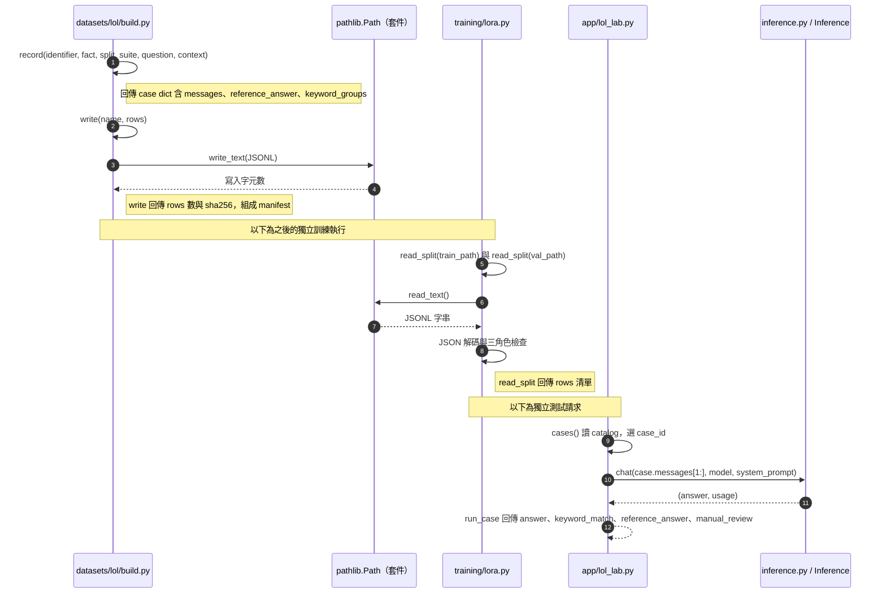

# 第 11 章｜訓練資料設計與實驗切分

所屬部分：第 4 部分「SFT 與 LoRA 微調實作」

訓練資料決定模型能學到什麼，也決定評估結論有多大範圍。本章以專案的小型 pilot 說明資料格式、切分與洩漏控制。

> 程式碼閱讀方式：本章「專案程式碼」為 2026-10-06 工作區原碼節錄，僅移除共同前置縮排，保留相對縮排與原始換行；片段可能依賴外部變數，不一定可單獨執行。行號以當時原檔為準，程式更新後請由檔案連結與函式名稱核對。

## 本章模組呼叫時序圖：資料產生器、訓練讀取器與測試模組

每條泳道是實際檔案中的模組／物件；標示「套件」或「服務」的是外部依賴。實線箭頭標出呼叫的函式及輸入，虛線箭頭標出回傳資料或例外；自我箭頭表示同一模組內部操作。欄位清單是回傳結構摘要，不是額外的函式參數。



**呼叫與回傳重點：** build.main、train 與 run_case 並不是彼此直接呼叫：它們經 JSONL 檔案銜接，圖中用註記分隔執行階段。reference_answer 只放進訓練 assistant 或測試評閱結果，不隨記憶題推論送出。

各函式的實際程式碼與原檔連結見下方小節；圖省略無關的 imports、日誌及部分前置檢查，不代表它們未執行。

## 11.1 以英雄聯盟歷史版本問答作為完整案例

資料主題是 PC 版英雄聯盟的歷史更新，不是即時遊戲百科。每個答案有指定版本與官方公告來源，問題及答案採自行整理的繁體中文。選擇此案例是為了觀察模型是否能學到特定更新，以及遇到新資料時能否依輸入回答。

版本限定非常重要：某個規則在 A 版成立，不表示在 B 版仍成立。教材使用資料集中的既有歷史標註，不把它延伸成目前遊戲規則。更換領域時也應保留日期、產品版本與條件，例如財報年度或設備型號。

**專案程式碼（節錄）**

檔案：[datasets/lol/build.py](<../../../datasets/lol/build.py>)；位置：`record`，第 49～62 行。[跳至起始行](<../../../datasets/lol/build.py#L49>)

<!-- project-code: datasets/lol/build.py:49-62 -->
```python
def record(identifier, fact, split, suite, question, context=""):
    version, _, answer, terms = fact
    # Asking for a release patch must not reveal that patch in the question.
    asks_patch = "哪一個版本推出" in question or "哪個版本推出" in question
    prompt = ("請依英雄聯盟 PC 版資料回答：" if asks_patch else
              f"請依英雄聯盟 PC 版 {version} 回答：") + question
    if context:
        prompt += "\n參考資料（改寫自 Riot 官方公告）：\n" + context
    return {"id": identifier, "split": split, "suite": suite,
            "fact_group": identifier.split('-')[0], "patch": version,
            "source_url": URLS[version], "checked_on": "2026-10-05",
            "messages": [{"role": "system", "content": SYSTEM},
                         {"role": "user", "content": prompt}],
            "reference_answer": answer, "keyword_groups": terms}
```

**閱讀重點：** 題目依版本建構，sources 與 reference_answer 保留作核對；推出版本題避免把答案塞進題目。

## 11.2 SFT 的 JSONL messages 格式

每行 JSON 是一個完整訓練範例，messages 依序為 system、user、assistant；專案讀取器要求正好這三種角色且內容非空。教學用格式如下：

```json
{"messages":[{"role":"system","content":"只回答指定版本的資料。"},{"role":"user","content":"在版本 A，一般濾網多久清潔？"},{"role":"assistant","content":"版本 A 規定每 30 天清潔一次。"}]}
```

這只是格式示意，不是現有遊戲資料。模型訓練時能看到示範答案；推論評估時則只傳入規則與問題，參考答案留在評閱端。JSONL 的好處是可逐行檢查與雜湊，但格式有效不代表內容標註正確。

**專案程式碼（節錄）**

檔案：[training/lora.py](<../../../training/lora.py>)；位置：`read_split`，第 40～50 行。[跳至起始行](<../../../training/lora.py#L40>)

<!-- project-code: training/lora.py:40-50 -->
```python
def read_split(path):
    rows = [json.loads(line) for line in Path(path).read_text().splitlines()]
    if not rows:
        raise ValueError("Empty split")
    for row in rows:
        messages = row.get("messages", [])
        if [m.get("role") for m in messages] != ["system", "user", "assistant"]:
            raise ValueError("Expected one system/user/assistant turn")
        if any(not isinstance(m.get("content"), str) or not m["content"].strip() for m in messages):
            raise ValueError("Empty message")
    return rows
```

**閱讀重點：** 資料必須是 system、user、assistant 三段且非空；這是格式檢查，不是事實審查。

## 11.3 專案的 60 筆 train、20 筆 validation、32 筆 test

train 有 60 筆，由 20 個事實各改寫三個問法；validation 有 20 筆，對同一批事實使用另一問法。test 有 32 題，分為 20 題記憶、8 題附新資料理解、4 題拒答。

`catalog.jsonl` 合計 112 筆，供介面觀察與分類使用，不應整份當訓練集。Modal 訓練映像只加入 train 與 validation，訓練函式也只讀這兩個檔案。Manifest 保存資料版本、筆數與 SHA-256，讓不同 run 能確認使用相同資料。

**專案程式碼（節錄）**

檔案：[deploy/modal_train.py](<../../../deploy/modal_train.py>)；位置：`訓練映像建構`，第 9～14 行。[跳至起始行](<../../../deploy/modal_train.py#L9>)

<!-- project-code: deploy/modal_train.py:9-14 -->
```python
image = (modal.Image.debian_slim(python_version="3.12")
    .pip_install_from_requirements(str(ROOT / "requirements-training.txt"))
    .env({"HF_HOME": "/model-cache", "TOKENIZERS_PARALLELISM": "false"})
    .add_local_dir(str(ROOT / "training"), remote_path="/root/training")
    .add_local_file(str(ROOT / "datasets/lol/v1/train.jsonl"), remote_path="/dataset/train.jsonl")
    .add_local_file(str(ROOT / "datasets/lol/v1/validation.jsonl"), remote_path="/dataset/validation.jsonl"))
```

**閱讀重點：** 只加入 train 與 validation，test 未被打包進這個訓練資料路徑。

## 11.4 為什麼 60 個改寫樣本不等於 60 個獨立事實

同一事實的不同問法有助於減少只記住某個固定句型，例如「哪一版推出」與「首次登場版本」都指向同一答案。但它們沒有增加知識涵蓋範圍，三種問法仍只有一個獨立事實。

如果資料只有 20 個事實，即使產生 2,000 個改寫，也不能宣稱涵蓋了 2,000 種知識。大量相似句還可能讓模型對狹窄模式過度擬合。報告應同時列樣本數、獨立事實數與主題分布。

**專案程式碼（節錄）**

檔案：[datasets/lol/build.py](<../../../datasets/lol/build.py>)；位置：`main`，第 73～78 行。[跳至起始行](<../../../datasets/lol/build.py#L73>)

<!-- project-code: datasets/lol/build.py:73-78 -->
```python
catalog, train, validation = [], [], []
for i, fact in enumerate(FACTS, 1):
    for j, prefix in enumerate(["", "請簡短說明：", "我想確認版本資料："], 1):
        row = record(f"f{i:02d}-train{j}", fact, "train", "knowledge_recall", prefix + fact[1])
        catalog.append(row)
        train.append({"messages": [*row["messages"], {"role": "assistant", "content": row["reference_answer"]}]})
```

**閱讀重點：** 對每個 fact 產生三種前綴問法；樣本數因此是事實數的三倍。

## 11.5 記憶題、附新資料的理解題、拒答題分別測什麼

記憶題不附答案來源內容，測試訓練後能否回答已學過的事實；它是閉卷式的新問法測試。未見資料理解題提供短 context，測試模型根據當下資料回答，不是憑空知道未訓練版本。

拒答題測資訊不足時是否避免猜測。三類應分開計分，因為高記憶分數可能伴隨閱讀能力下降或過度拒答。附 context 的題目若答案直接出現在短句中，難度有限，不能當成複雜推理能力的證明。

**專案程式碼（節錄）**

檔案：[datasets/lol/build.py](<../../../datasets/lol/build.py>)；位置：`main`，第 79～93 行。[跳至起始行](<../../../datasets/lol/build.py#L79>)

<!-- project-code: datasets/lol/build.py:79-93 -->
```python
    row = record(f"f{i:02d}-val", fact, "validation", "knowledge_recall", "核對歷史規則，" + fact[1])
    catalog.append(row)
    validation.append({"messages": [*row["messages"], {"role": "assistant", "content": row["reference_answer"]}]})
    catalog.append(record(f"f{i:02d}-test", fact, "test", "knowledge_recall", "朋友說他不確定，請幫忙回答：" + fact[1]))
for i, fact in enumerate(HELDOUT, 1):
    catalog.append(record(f"h{i:02d}-test", fact, "test", "unseen_context", fact[1], fact[2]))
for i, question in enumerate([
    "請給出 2030 年世界賽冠軍及比分。", "請給出尚未公布的 2031 年新英雄完整技能數值。",
    "只根據這段資料，Mel 在 25.S1.2 的全球勝率精確到小數點後兩位是多少？",
    "只根據這段資料，Ambessa 在 14.22 的全球選用率是多少？",
], 1):
    fact = ("25.06", question, "不知道；提供的資料未包含這項資訊，無法可靠回答。", [])
    row = record(f"u{i:02d}-test", fact, "test", "refusal", question, "資料僅說明 25.06 的反換線與賞金調整，未包含賽事結果或英雄勝率。")
    row["expected_refusal"] = True
    catalog.append(row)
```

**閱讀重點：** knowledge_recall、unseen_context 與 refusal 有不同的輸入與評估意義。

## 11.6 訓練與驗證共享事實時，能得出哪些結論

Validation 與 train 共享事實，所以 eval loss 下降可支持「模型更能預測這批事實的新問法答案」，無法證明能掌握未見知識。它適合選 checkpoint 與觀察流程，但結論必須限定範圍。

若研究目標是新文件或新主題泛化，應按事實、文件或主題分組切分，再在群組內產生改寫。先改寫再隨機分配句子，容易把幾乎相同的答案放進所有 split。這是未來正式資料集的設計方向，不是目前 pilot 已提供的保證。

**專案程式碼（節錄）**

檔案：[datasets/lol/build.py](<../../../datasets/lol/build.py>)；位置：`main`，第 74～82 行。[跳至起始行](<../../../datasets/lol/build.py#L74>)

<!-- project-code: datasets/lol/build.py:74-82 -->
```python
for i, fact in enumerate(FACTS, 1):
    for j, prefix in enumerate(["", "請簡短說明：", "我想確認版本資料："], 1):
        row = record(f"f{i:02d}-train{j}", fact, "train", "knowledge_recall", prefix + fact[1])
        catalog.append(row)
        train.append({"messages": [*row["messages"], {"role": "assistant", "content": row["reference_answer"]}]})
    row = record(f"f{i:02d}-val", fact, "validation", "knowledge_recall", "核對歷史規則，" + fact[1])
    catalog.append(row)
    validation.append({"messages": [*row["messages"], {"role": "assistant", "content": row["reference_answer"]}]})
    catalog.append(record(f"f{i:02d}-test", fact, "test", "knowledge_recall", "朋友說他不確定，請幫忙回答：" + fact[1]))
```

**閱讀重點：** validation 在同一個 fact 迴圈中產生，明確顯示它與 train 共享事實。

## 11.7 資料洩漏、測試集污染與反覆依測試結果調參的問題

直接把 test 的 assistant 答案加入 train 是明顯洩漏；反覆看 test 結果後改 prompt、挑 rank 或修改資料，也會間接把 test 變成開發集。最終分數因此可能過度樂觀。

本專案把 reference_answer 與推論 messages 分開，但使用者仍需在實驗流程上避免污染。應先用 train／validation 選設定，凍結後再跑 test。若已多次依 test 調整，就承認它是開發資料，另建立未使用的最終測試集。

**專案程式碼（節錄）**

檔案：[app/lol_lab.py](<../../../app/lol_lab.py>)；位置：`run_case`，第 23～34 行。[跳至起始行](<../../../app/lol_lab.py#L23>)

<!-- project-code: app/lol_lab.py:23-34 -->
```python
start = time.monotonic()
answer, usage = service.inference.chat(case["messages"][1:], model,
    system_prompt=case["messages"][0]["content"])
groups = case["keyword_groups"]
return {"case_id": case_id, "dataset_version": "lol-pilot-v1",
        "model": {k: model[k] for k in ("id", "base_model", "base_revision", "served_name")},
        "messages": case["messages"], "answer": answer, "usage": usage,
        "elapsed_seconds": round(time.monotonic() - start, 3),
        "keyword_match": all(any(term.casefold() in answer.casefold() for term in group)
                             for group in groups) if groups else None,
        "reference_answer": case["reference_answer"], "source_url": case["source_url"],
        "manual_review": {"correct": None, "notes": ""}}
```

**閱讀重點：** 送往 inference 的只有 messages；reference_answer 在呼叫結束後放進評閱結果。

## 實作練習與判讀

在專案根目錄執行以下離線檢查：

```python
import json
from pathlib import Path

root = Path("datasets/lol/v1")
for name in ["train", "validation", "test", "catalog"]:
    rows = [json.loads(line) for line in (root / f"{name}.jsonl").read_text().splitlines() if line.strip()]
    print(name, len(rows))
```

預期筆數為 60、20、32、112。再人工挑一個事實，找出 train 的三種問法與 validation 的問法，說明它們為何不是獨立知識。不要把 catalog 的所有答案送進訓練。

## 程式碼與延伸閱讀

- [資料集說明與限制](../../../datasets/lol/README.md)
- [資料集建立程式](../../../datasets/lol/build.py)
- [訓練資料讀取與角色檢查](../../../training/lora.py)
- [測試輸入與參考答案分離](../../../app/lol_lab.py)

[返回教材目錄](../README.md)
