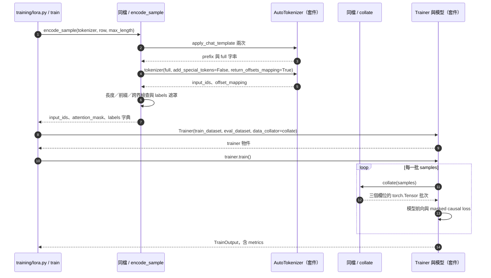

# 第 12 章｜SFT 訓練目標與 Assistant-only Loss

所屬部分：第 4 部分「SFT 與 LoRA 微調實作」

本章深入一筆問答如何變成可計算的訓練目標。最重要的區分是：模型可以讀取的 token，與被納入 loss 的 token，並不是同一集合。

> 程式碼閱讀方式：本章「專案程式碼」為 2026-10-06 工作區原碼節錄，僅移除共同前置縮排，保留相對縮排與原始換行；片段可能依賴外部變數，不一定可單獨執行。行號以當時原檔為準，程式更新後請由檔案連結與函式名稱核對。

## 本章模組呼叫時序圖：encode_sample、collate 與模型 loss 的實際接口

每條泳道是實際檔案中的模組／物件；標示「套件」或「服務」的是外部依賴。實線箭頭標出呼叫的函式及輸入，虛線箭頭標出回傳資料或例外；自我箭頭表示同一模組內部操作。欄位清單是回傳結構摘要，不是額外的函式參數。



**呼叫與回傳重點：** encode_sample 回傳 Python 清單，collate 才轉成 tensor；兩者不可混為同一步。loss 由套件中的因果模型計算，collate 不回傳 loss。

各函式的實際程式碼與原檔連結見下方小節；圖省略無關的 imports、日誌及部分前置檢查，不代表它們未執行。

## 12.1 監督式微調如何利用正確回答更新模型

SFT 使用已知的示範回答，讓模型在相同前文下更容易產生這些回答。訓練時前向傳播算出下一個 token 的分布，loss 衡量與正確 token 的差距，再透過反向傳播與 optimizer 更新可訓練參數。

這通常使用 teacher forcing：預測回答後面的 token 時，前文是資料中的正確 token，而非模型先前自由生成的錯誤輸出。因此 teacher-forced loss 很低，不代表自由生成一定完全正確；生成過程的第一個錯誤可能影響整個後續答案。

**專案程式碼（節錄）**

檔案：[training/lora.py](<../../../training/lora.py>)；位置：`train`，第 161～168 行。[跳至起始行](<../../../training/lora.py#L161>)

<!-- project-code: training/lora.py:161-168 -->
```python
trainer = Trainer(model=model, args=args, train_dataset=train_data,
    eval_dataset=val_data, data_collator=collate, callbacks=[Metrics()])
baseline_loss = trainer.evaluate()["eval_loss"]
result = trainer.train()
final = trainer.evaluate()
adapter = output / "adapter"
model.save_pretrained(adapter, safe_serialization=True)
tokenizer.save_pretrained(output / "tokenizer")
```

**閱讀重點：** 依序建立 Trainer、初始評估、train、最終評估，再保存 adapter。

## 12.2 Token-level cross-entropy 的直覺與計算概念

對每個監督位置，交叉熵可理解成正確 token 機率的負對數：$L_t=-\log P(y_t\mid x,y_{<t})$。若正確 token 機率由 0.1 提高到 0.5，loss 便從約 2.303 降到 0.693。

Assistant-only 目標只聚合回答位置：$L=-\frac{1}{|M|}\sum_{t\in M}\log P(y_t\mid x,y_{<t})$，M 是未被遮罩的目標位置。這是概念公式；Trainer 跨 batch 的匯總還取決於版本與 loss reduction。Loss 評估的是 token 預測，不會直接判定整句事實真偽。

**專案程式碼（節錄）**

檔案：[training/lora.py](<../../../training/lora.py>)；位置：`train`，第 161～165 行。[跳至起始行](<../../../training/lora.py#L161>)

<!-- project-code: training/lora.py:161-165 -->
```python
trainer = Trainer(model=model, args=args, train_dataset=train_data,
    eval_dataset=val_data, data_collator=collate, callbacks=[Metrics()])
baseline_loss = trainer.evaluate()["eval_loss"]
result = trainer.train()
final = trainer.evaluate()
```

**閱讀重點：** 專案把 loss 計算交給因果模型／Trainer，沒有在這裡手寫交叉熵公式。

## 12.3 input_ids、attention_mask、labels 的用途

`input_ids` 是完整對話的 token ID；`attention_mask` 標記哪些輸入位置是真實內容、哪些是 padding；`labels` 是預測目標。因果模型內部通常會處理下一個 token 的位移對齊，不應在不確認實作時額外手動 shift 一次。

專案 `encode_sample()` 對每個 token 建立對應 label，保留完整 prompt 作為輸入。Data collator 再將同批樣本補到相同長度，input_ids 用 pad token、attention_mask 用 0、labels 用 -100 補齊。Padding 是批次對齊手段，不是新增訓練知識。

**專案程式碼（節錄）**

檔案：[training/lora.py](<../../../training/lora.py>)；位置：`train.collate`，第 146～149 行。[跳至起始行](<../../../training/lora.py#L146>)

<!-- project-code: training/lora.py:146-149 -->
```python
def collate(samples):
    size = max(len(s["input_ids"]) for s in samples)
    return {key: torch.tensor([s[key] + [pad] * (size - len(s[key])) for s in samples])
            for key, pad in [("input_ids", tokenizer.pad_token_id), ("attention_mask", 0), ("labels", -100)]}
```

**閱讀重點：** 三種欄位分別以 pad token、0 與 -100 補齊，意義不同。

## 12.4 為什麼把 system、user 與 padding 的 labels 設成 -100

`-100` 表示該目標位置不計入此交叉熵 loss，並不是詞彙表中的 token。System 和 user 是條件資訊，仍在 input_ids 中，也仍能被後續 assistant 注意到；只是不要求模型學會重寫題目或系統規則。

例如輸入 ID 示意為 `[11,12,13,21,22]`，前三個位置是 prompt，後兩個是回答，labels 可為 `[-100,-100,-100,21,22]`。這是概念示意，不是 Qwen 的實際 ID。把 prompt 的 attention_mask 也設成 0 會改變模型可讀的內容，與 assistant-only loss 不同。

**專案程式碼（節錄）**

檔案：[training/lora.py](<../../../training/lora.py>)；位置：`encode_sample`，第 66～73 行。[跳至起始行](<../../../training/lora.py#L66>)

<!-- project-code: training/lora.py:66-73 -->
```python
labels = []
for token, (start, end) in zip(tokens, encoded["offset_mapping"]):
    if start < len(prefix) < end and full[start:len(prefix)].strip():
        raise ValueError("A token crosses a non-whitespace prompt boundary")
    labels.append(-100 if end <= len(prefix) else token)
if not any(label != -100 for label in labels):
    raise ValueError("No supervised completion tokens")
return {"input_ids": tokens, "attention_mask": [1] * len(tokens), "labels": labels}
```

**閱讀重點：** prompt 對應 labels=-100，但 input_ids 保留完整 tokens，沒有刪掉條件資訊。

## 12.5 Assistant 回答與結束 token 如何參與 loss

專案把 assistant completion 與其後的結束標記納入監督，讓模型不只學到內容，也學到何時停止。若把真實結束 token 全部遮掉，可能削弱停止行為的學習。

程式設定 pad token 等於 eos token，但利用位置的 attention mask 與 label 區分真實結束與補齊。不能簡單地把所有等於 eos ID 的 label 全設為 -100，否則會把真正回答結尾也刪掉。

**專案程式碼（節錄）**

檔案：[training/lora.py](<../../../training/lora.py>)；位置：`train`，第 105～110 行。[跳至起始行](<../../../training/lora.py#L105>)

<!-- project-code: training/lora.py:105-110 -->
```python
set_seed(config.seed)
tokenizer = AutoTokenizer.from_pretrained(config.model, revision=config.revision)
tokenizer.pad_token = tokenizer.eos_token
tokenizer.padding_side = "right"
train_data = Dataset.from_list([encode_sample(tokenizer, row, config.max_length) for row in rows])
val_data = Dataset.from_list([encode_sample(tokenizer, row, config.max_length) for row in validation])
```

**閱讀重點：** pad_token 設為 eos_token，因此必須靠 label 與位置區分 padding 和真正結尾。

**專案程式碼（節錄）**

檔案：[training/lora.py](<../../../training/lora.py>)；位置：`encode_sample`，第 66～73 行。[跳至起始行](<../../../training/lora.py#L66>)

<!-- project-code: training/lora.py:66-73 -->
```python
labels = []
for token, (start, end) in zip(tokens, encoded["offset_mapping"]):
    if start < len(prefix) < end and full[start:len(prefix)].strip():
        raise ValueError("A token crosses a non-whitespace prompt boundary")
    labels.append(-100 if end <= len(prefix) else token)
if not any(label != -100 for label in labels):
    raise ValueError("No supervised completion tokens")
return {"input_ids": tokens, "attention_mask": [1] * len(tokens), "labels": labels}
```

**閱讀重點：** completion 的 token ID 保留為 label，沒有把所有 EOS ID 一律遮掉。

## 12.6 專案如何檢查 template prefix 與 token 邊界

`encode_sample()` 先渲染沒有 assistant 的 prefix，再渲染完整 messages，要求 full 以 prefix 開頭。接著利用 fast tokenizer 的字元 offsets 判斷哪些 token 位於 prompt 範圍，避免只憑另一次 tokenize 的長度猜邊界。

若某 token 跨越非空白 prompt 邊界，程式直接拒絕，避免把 prompt 內容算入回答 loss。這種明確檢查比「大概切在這裡」可靠；模型 template 改版時，失敗能提醒開發者重新驗證遮罩，而非默默訓練錯誤目標。

**專案程式碼（節錄）**

檔案：[training/lora.py](<../../../training/lora.py>)；位置：`encode_sample`，第 56～70 行。[跳至起始行](<../../../training/lora.py#L56>)

<!-- project-code: training/lora.py:56-70 -->
```python
prefix = tokenizer.apply_chat_template(messages[:-1], tokenize=False,
    add_generation_prompt=True, enable_thinking=False)
full = tokenizer.apply_chat_template(messages, tokenize=False,
    add_generation_prompt=False, enable_thinking=False)
if not full.startswith(prefix):
    raise ValueError("Chat template prefix mismatch; refusing an incorrect loss mask")
encoded = tokenizer(full, add_special_tokens=False, return_offsets_mapping=True)
tokens = encoded["input_ids"]
if len(tokens) > max_length:
    raise ValueError("Sample exceeds max_length; increase it or edit data, do not silently truncate answers")
labels = []
for token, (start, end) in zip(tokens, encoded["offset_mapping"]):
    if start < len(prefix) < end and full[start:len(prefix)].strip():
        raise ValueError("A token crosses a non-whitespace prompt boundary")
    labels.append(-100 if end <= len(prefix) else token)
```

**閱讀重點：** 先比字串前綴，再用 offsets 找邊界；跨越非空白邊界時直接拒絕。

## 12.7 為什麼超長樣本採拒絕處理，而非默默截斷

如果只保留 max_length 前面的 token，可能把答案尾端或整個 assistant 刪掉，剩下一筆無法完成任務的樣本。也可能留下看似正常的前半答案，卻讓模型學到不完整句子。

專案超過長度上限就報錯，也拒絕沒有任何回答 label 的樣本。解法是人工精簡資料、分拆任務或在硬體容許下增加上限，而不是取消檢查。這比把資料品質問題藏成不明的訓練品質下降更容易診斷。

**專案程式碼（節錄）**

檔案：[training/lora.py](<../../../training/lora.py>)；位置：`encode_sample`，第 62～73 行。[跳至起始行](<../../../training/lora.py#L62>)

<!-- project-code: training/lora.py:62-73 -->
```python
encoded = tokenizer(full, add_special_tokens=False, return_offsets_mapping=True)
tokens = encoded["input_ids"]
if len(tokens) > max_length:
    raise ValueError("Sample exceeds max_length; increase it or edit data, do not silently truncate answers")
labels = []
for token, (start, end) in zip(tokens, encoded["offset_mapping"]):
    if start < len(prefix) < end and full[start:len(prefix)].strip():
        raise ValueError("A token crosses a non-whitespace prompt boundary")
    labels.append(-100 if end <= len(prefix) else token)
if not any(label != -100 for label in labels):
    raise ValueError("No supervised completion tokens")
return {"input_ids": tokens, "attention_mask": [1] * len(tokens), "labels": labels}
```

**閱讀重點：** 超長與沒有監督 token 都是明確錯誤，不會產生被靜默截斷的訓練樣本。

## 實作練習與判讀

先做不用模型的數值練習：以 `-math.log(0.1)` 與 `-math.log(0.5)` 比較 loss。再用已快取的固定 revision tokenizer 與現有 train 第一筆執行：

```python
from training.lora import read_split, encode_sample

row = read_split("datasets/lol/v1/train.jsonl")[0]
encoded = encode_sample(tokenizer, row, max_length=1024)
answer_ids = [label for label in encoded["labels"] if label != -100]
print(tokenizer.decode(answer_ids, skip_special_tokens=False))
```

`tokenizer` 使用第 2 章建立的物件。輸出應包含回答及其結束格式，不應包含 user 問題。請另查看完整 input_ids，確認問題仍然存在於模型輸入。這個檢查不需要載入 8B 生成模型。

## 程式碼與延伸閱讀

- [encode_sample 與 collator](../../../training/lora.py)
- [訓練與遮罩測試](../../../tests/test_training.py)
- [Transformers 4.57.1 Trainer](https://huggingface.co/docs/transformers/v4.57.1/en/main_classes/trainer)

[返回教材目錄](../README.md)
