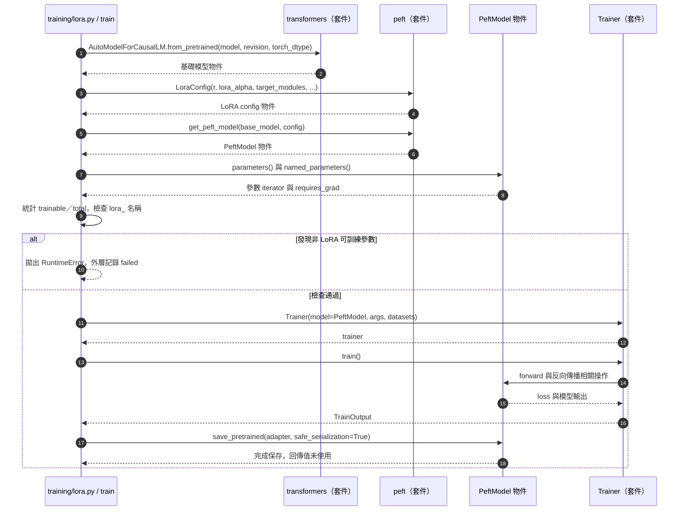

# 第 13 章｜LoRA 原理與 PEFT 實作

所屬部分：第 4 部分「SFT 與 LoRA 微調實作」

LoRA 讓微調只更新一小部分新增參數。本章從矩陣形狀推導參數量，再對照本專案 PEFT 設定，避免把「省參數」誤解為「不需要載入基礎模型」。

> 程式碼閱讀方式：本章「專案程式碼」為 2026-10-06 工作區原碼節錄，僅移除共同前置縮排，保留相對縮排與原始換行；片段可能依賴外部變數，不一定可單獨執行。行號以當時原檔為準，程式更新後請由檔案連結與函式名稱核對。

## 本章模組呼叫時序圖：train 如何建立與驗證 PEFT 模型

每條泳道是實際檔案中的模組／物件；標示「套件」或「服務」的是外部依賴。實線箭頭標出呼叫的函式及輸入，虛線箭頭標出回傳資料或例外；自我箭頭表示同一模組內部操作。欄位清單是回傳結構摘要，不是額外的函式參數。



**呼叫與回傳重點：** get_peft_model 回傳模型包裝物件，不是 adapter 檔案；檔案要等 save_pretrained 才產生。BAx、參數凍結與實際梯度處理由 PEFT／PyTorch 處理，圖上不虛構專案內部矩陣函式。

各函式的實際程式碼與原檔連結見下方小節；圖省略無關的 imports、日誌及部分前置檢查，不代表它們未執行。

## 13.1 全參數微調與參數高效率微調的差別

全參數微調允許更新基礎模型的廣泛權重，因此需要相應梯度與 optimizer state。參數高效率微調（PEFT）則只訓練部分參數或新增模組；LoRA 是其中一種，凍結原權重，學習額外的低秩更新。

這讓不同任務可保存較小的 adapter，推論時搭配同一基礎模型。但凍結不代表省略前向傳播，基礎權重與 activations 仍占資源，也仍需透過模型傳遞梯度以更新 adapter。方法背景參考 [LoRA 原始論文](https://arxiv.org/abs/2106.09685)。

**專案程式碼（節錄）**

檔案：[training/lora.py](<../../../training/lora.py>)；位置：`train`，第 114～120 行。[跳至起始行](<../../../training/lora.py#L114>)

<!-- project-code: training/lora.py:114-120 -->
```python
model = get_peft_model(model, LoraConfig(r=config.rank, lora_alpha=config.alpha,
    lora_dropout=0.05, target_modules=["q_proj", "k_proj", "v_proj", "o_proj", "gate_proj", "up_proj", "down_proj"],
    bias="none", task_type="CAUSAL_LM", base_model_name_or_path=config.model, revision=config.revision))
trainable = sum(p.numel() for p in model.parameters() if p.requires_grad)
total = sum(p.numel() for p in model.parameters())
if not trainable or any(p.requires_grad and "lora_" not in name for name, p in model.named_parameters()):
    raise RuntimeError("Unexpected trainable base parameters")
```

**閱讀重點：** 加入 LoRA 後檢查只有 lora_ 參數可訓練，具體落實凍結基礎模型。

## 13.2 LoRA 的核心公式：$W' = W + \frac{\alpha}{r}BA$

對原本線性層 $y=Wx$，標準 LoRA 寫成 $y=Wx+(\alpha/r)BAx$。若 $W$ 是 $d_{out}\times d_{in}$，則 A 是 $r\times d_{in}$，B 是 $d_{out}\times r$，兩者相乘後形狀與 W 相同。

原矩陣有 $d_{out}d_{in}$ 個參數，新增量只有 $r(d_{in}+d_{out})$。例如 4,096×4,096 的示意矩陣有 16,777,216 個參數；r=8 時 A、B 合計 65,536，約為原矩陣的 0.39%。這是單層算例，不是本模型整體比例。

本專案保存 A、B 所形成的 adapter，不把結果直接覆寫基礎權重。上述公式對應目前標準 LoRA；其他 scaling 變體不能不加區分地套用。

**專案程式碼（節錄）**

檔案：[training/lora.py](<../../../training/lora.py>)；位置：`train`，第 114～116 行。[跳至起始行](<../../../training/lora.py#L114>)

<!-- project-code: training/lora.py:114-116 -->
```python
model = get_peft_model(model, LoraConfig(r=config.rank, lora_alpha=config.alpha,
    lora_dropout=0.05, target_modules=["q_proj", "k_proj", "v_proj", "o_proj", "gate_proj", "up_proj", "down_proj"],
    bias="none", task_type="CAUSAL_LM", base_model_name_or_path=config.model, revision=config.revision))
```

**閱讀重點：** 此處把 r 與 alpha 傳給 PEFT；BA 矩陣分支由套件實作，不在專案重寫公式。

## 13.3 Rank、alpha、dropout 如何影響訓練

Rank r 限制更新矩陣可表達的秩，較大時參數更多、容量更高，但不保證測試效果更好。Alpha 控制更新分支的縮放；本專案 r=8、alpha=16，所以係數為 2。

Dropout 設為 0.05，用於訓練 LoRA 分支的正則化。它和 temperature 完全不同：前者影響訓練，後者影響生成抽樣。比較 rank 時若同時改 alpha，就也改了縮放條件；應記錄比例與所有設定。參數定義見 [PEFT LoRA 文件](https://huggingface.co/docs/peft/package_reference/lora)。

**專案程式碼（節錄）**

檔案：[training/lora.py](<../../../training/lora.py>)；位置：`train`，第 114～116 行。[跳至起始行](<../../../training/lora.py#L114>)

<!-- project-code: training/lora.py:114-116 -->
```python
model = get_peft_model(model, LoraConfig(r=config.rank, lora_alpha=config.alpha,
    lora_dropout=0.05, target_modules=["q_proj", "k_proj", "v_proj", "o_proj", "gate_proj", "up_proj", "down_proj"],
    bias="none", task_type="CAUSAL_LM", base_model_name_or_path=config.model, revision=config.revision))
```

**閱讀重點：** rank、alpha 與 dropout 作用不同；不要把 dropout 當推論 temperature。

## 13.4 Attention 與 MLP 的七種 projection 層為什麼成為訓練目標

專案 target_modules 包含 attention 的 `q_proj`、`k_proj`、`v_proj`、`o_proj`，以及 MLP 的 `gate_proj`、`up_proj`、`down_proj`。前者影響資訊如何被關聯與彙整，後者影響特徵如何轉換。

將 LoRA 加到七種投影，是此實驗選擇的覆蓋範圍，不是所有模型必須使用的固定清單。模組名稱與尺寸依模型架構不同；換模型時應檢查實際 named_modules。某些投影維度也不一定相等，不能一律用 4,096×4,096 推算總量。

**專案程式碼（節錄）**

檔案：[training/lora.py](<../../../training/lora.py>)；位置：`train`，第 114～116 行。[跳至起始行](<../../../training/lora.py#L114>)

<!-- project-code: training/lora.py:114-116 -->
```python
model = get_peft_model(model, LoraConfig(r=config.rank, lora_alpha=config.alpha,
    lora_dropout=0.05, target_modules=["q_proj", "k_proj", "v_proj", "o_proj", "gate_proj", "up_proj", "down_proj"],
    bias="none", task_type="CAUSAL_LM", base_model_name_or_path=config.model, revision=config.revision))
```

**閱讀重點：** target_modules 明列七種 projection；更換模型時需確認名稱與形狀。

## 13.5 如何凍結基礎模型，只更新 LoRA 參數

`get_peft_model()` 依 `LoraConfig` 包装模型，配置 `bias="none"`，不另外訓練 bias。接著程式統計 `requires_grad=True` 的參數，並確認可訓練名稱都包含 `lora_`；若有意外開放的基礎參數就停止。

這個斷言把「我們打算只訓練 LoRA」變成可檢查的條件。訓練完成後還可檢查 adapter 權重是否有限、是否確實從初始化改變。不過權重變動只能證明有更新，不能證明新行為有用。

**專案程式碼（節錄）**

檔案：[training/lora.py](<../../../training/lora.py>)；位置：`train`，第 117～120 行。[跳至起始行](<../../../training/lora.py#L117>)

<!-- project-code: training/lora.py:117-120 -->
```python
trainable = sum(p.numel() for p in model.parameters() if p.requires_grad)
total = sum(p.numel() for p in model.parameters())
if not trainable or any(p.requires_grad and "lora_" not in name for name, p in model.named_parameters()):
    raise RuntimeError("Unexpected trainable base parameters")
```

**閱讀重點：** requires_grad 與名稱斷言防止意外訓練基礎參數。

## 13.6 專案的 rank 8、alpha 16 設定與可訓練參數比例

專案完整 run 的既有紀錄列出可訓練參數 21,823,488，約占包裝後模型總參數的 0.266%。此比例來自實際參數統計，不應用單一矩陣的算例取代。

預設 rank 8、alpha 16、dropout 0.05 是小型 pilot 起點。低比例能降低更新與產物的負擔，但模型仍可能過擬合、記錯答案或損害其他行為。應配合資料量、驗證 loss 與最終回答評閱，而非把「訓練參數少」當成不會出問題的保證。

**專案程式碼（節錄）**

檔案：[training/lora.py](<../../../training/lora.py>)；位置：`train`，第 117～123 行。[跳至起始行](<../../../training/lora.py#L117>)

<!-- project-code: training/lora.py:117-123 -->
```python
trainable = sum(p.numel() for p in model.parameters() if p.requires_grad)
total = sum(p.numel() for p in model.parameters())
if not trainable or any(p.requires_grad and "lora_" not in name for name, p in model.named_parameters()):
    raise RuntimeError("Unexpected trainable base parameters")
metadata.update({"trainable_parameters": trainable, "total_parameters": total,
    "trainable_fraction": trainable / total, "gpu": torch.cuda.get_device_name(),
    "versions": {"torch": torch.__version__, "transformers": transformers.__version__, "peft": peft.__version__}})
```

**閱讀重點：** 比例來自實際模型的參數統計，並連同 GPU 與套件版本保存。

## 13.7 明確區分目前的 BF16 LoRA 與延伸技術 QLoRA

目前程式以 `torch.bfloat16` 載入基礎模型，搭配 BF16 訓練設定，沒有 4-bit 載入與量化設定，因此是 BF16 LoRA。BF16 是浮點資料型別，不等於 QLoRA 的低位元量化策略。

QLoRA 的核心是對凍結基礎權重採低位元量化，再訓練 adapter，減少記憶體需求。量化格式、運算型別、optimizer 與支援套件都需要相應配置，不能只把 dtype 改名就完成。此技術屬延伸方向，背景見 [QLoRA 原始論文](https://arxiv.org/abs/2305.14314)。

**專案程式碼（節錄）**

檔案：[training/lora.py](<../../../training/lora.py>)；位置：`train`，第 111～116 行。[跳至起始行](<../../../training/lora.py#L111>)

<!-- project-code: training/lora.py:111-116 -->
```python
model = AutoModelForCausalLM.from_pretrained(config.model, revision=config.revision,
    torch_dtype=torch.bfloat16, attn_implementation="sdpa")
model.config.use_cache = False
model = get_peft_model(model, LoraConfig(r=config.rank, lora_alpha=config.alpha,
    lora_dropout=0.05, target_modules=["q_proj", "k_proj", "v_proj", "o_proj", "gate_proj", "up_proj", "down_proj"],
    bias="none", task_type="CAUSAL_LM", base_model_name_or_path=config.model, revision=config.revision))
```

**閱讀重點：** 載入 dtype 為 bfloat16，這段沒有 4-bit quantization_config，因此不是 QLoRA。

## 實作練習與判讀

先用不用 GPU 的參數量算例觀察 rank 的成本：

```python
d_in = d_out = 4096
for rank in [4, 8, 16, 32]:
    added = rank * (d_in + d_out)
    print(rank, added, added / (d_in * d_out))
```

接著閱讀 `LoraConfig` 與可訓練參數斷言，說明為什麼上面的比例與實際 0.266% 不同。要做真實 rank 比較時，先固定資料、基礎模型、訓練步數與評估方式，再決定是否保持 alpha/r 一致。

## 程式碼與延伸閱讀

- [PEFT 設定與參數檢查](../../../training/lora.py)
- [既有訓練比例與產物驗證](../../lora-training.md)

[返回教材目錄](../README.md)
