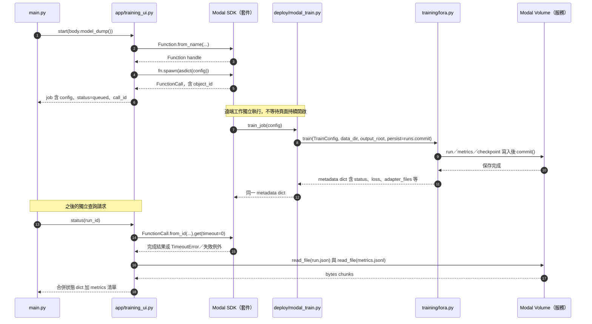

# 第 14 章｜GPU 訓練流程與 Metrics 判讀

所屬部分：第 4 部分「SFT 與 LoRA 微調實作」

本章從一個 run 的生命週期閱讀訓練，而不是只看最後一個 loss 數字。教材命令提供重現方式，本次撰寫沒有提交新的 GPU 任務。

> 程式碼閱讀方式：本章「專案程式碼」為 2026-10-06 工作區原碼節錄，僅移除共同前置縮排，保留相對縮排與原始換行；片段可能依賴外部變數，不一定可單獨執行。行號以當時原檔為準，程式更新後請由檔案連結與函式名稱核對。

## 本章模組呼叫時序圖：訓練提交、遠端函式與狀態查詢

每條泳道是實際檔案中的模組／物件；標示「套件」或「服務」的是外部依賴。實線箭頭標出呼叫的函式及輸入，虛線箭頭標出回傳資料或例外；自我箭頭表示同一模組內部操作。欄位清單是回傳結構摘要，不是額外的函式參數。



**呼叫與回傳重點：** HTTP 提交回傳的 job 與訓練完成的 metadata 是不同物件。TimeoutError 在 status 中表示工作可能仍在執行，不直接當成失敗。訓練寫入掛載路徑後 commit，查詢透過 read_bytes 將 chunks 合併。

各函式的實際程式碼與原檔連結見下方小節；圖省略無關的 imports、日誌及部分前置檢查，不代表它們未執行。

## 14.1 Transformers Trainer、PEFT 與 Modal 如何串接

Modal 建立 Linux CUDA 工作環境並提供 GPU；Transformers 載入 tokenizer 與因果語言模型；PEFT 插入 LoRA；Trainer 管理批次、反向傳播、optimizer、評估與 checkpoint。訓練容器依 `requirements-training.txt` 固定套件，不使用 Mac 的應用套件組合。

流程先驗證資料與唯一 run ID，再確認 CUDA 與 BF16 支援，載入模型、套用 LoRA、執行初始 validation、訓練、最終 validation、保存產物。網頁透過 detached FunctionCall 提交，並保存 handle；重新整理頁面不代表訓練停止。Trainer 介面以 [4.57.1 版文件](https://huggingface.co/docs/transformers/v4.57.1/en/main_classes/trainer)對照。

**專案程式碼（節錄）**

檔案：[deploy/modal_train.py](<../../../deploy/modal_train.py>)；位置：`train_job`，第 17～22 行。[跳至起始行](<../../../deploy/modal_train.py#L17>)

<!-- project-code: deploy/modal_train.py:17-22 -->
```python
@app.function(image=image, gpu=["L40S", "A100-40GB"], cpu=4, memory=32768,
              volumes={"/model-cache": cache, "/runs": runs}, timeout=3600,
              max_containers=1, retries=0)
def train_job(config):
    from training.lora import TrainConfig, train
    return train(TrainConfig(**config), "/dataset", "/runs", persist=runs.commit)
```

**閱讀重點：** Modal 提供 GPU／Volume，train_job 呼叫真正的訓練函式並傳入 commit callback。

## 14.2 Learning rate、epoch、microbatch、gradient accumulation、seed

Learning rate 決定更新尺度，預設 1e-4；epoch 表示資料集遍歷次數，預設 1。Microbatch 是一次前向／反向的樣本數，此處為 1；gradient accumulation=4 表示累積四個 microbatch 後做一次 optimizer 更新。

單 GPU 且完整批次時，有效 batch 約為 `1 × 4 = 4` 筆，60 筆一個 epoch 對應 15 次更新。最後不足批次、多 GPU 或 max_steps 都可能改變計算。正數 max_steps 優先於 epoch 計畫。Seed=42 幫助固定抽樣與初始化，但不同 GPU、kernel 或套件版本仍可能造成數值差異。

**專案程式碼（節錄）**

檔案：[training/lora.py](<../../../training/lora.py>)；位置：`train 的 TrainingArguments`，第 151～160 行。[跳至起始行](<../../../training/lora.py#L151>)

<!-- project-code: training/lora.py:151-160 -->
```python
args = TrainingArguments(output_dir=str(output / "checkpoints"),
    num_train_epochs=config.epochs, max_steps=config.max_steps,
    learning_rate=config.learning_rate, per_device_train_batch_size=1,
    per_device_eval_batch_size=1, gradient_accumulation_steps=config.gradient_accumulation,
    gradient_checkpointing=True, gradient_checkpointing_kwargs={"use_reentrant": False},
    bf16=True, optim="adamw_torch", logging_steps=1, eval_strategy="steps", eval_steps=5,
    save_strategy="steps", save_steps=5, save_total_limit=2,
    load_best_model_at_end=True, metric_for_best_model="eval_loss", greater_is_better=False,
    report_to=["tensorboard"], logging_dir=str(output / "tensorboard"),
    seed=config.seed, data_seed=config.seed, remove_unused_columns=False)
```

**閱讀重點：** 每裝置 batch、累積步數、epoch 與 max_steps 都在此傳給 Trainer。

## 14.3 Gradient checkpointing 與 BF16 的作用

Gradient checkpointing 不保留全部中間 activations，而在反向時重算部分內容，用額外運算換記憶體。它與把訓練狀態保存到磁碟的 checkpoint 是兩個不同概念。

BF16 用較短浮點表示降低部分記憶體與運算成本，前提是 GPU 與 runtime 支援；不代表每個 tensor 都必然以 BF16 儲存。程式同時關閉訓練時的 `use_cache`，避免沿用推論 KV cache 的配置。這些設定只能降低某些負擔，不能保證任意長度都不會 OOM。

**專案程式碼（節錄）**

檔案：[training/lora.py](<../../../training/lora.py>)；位置：`train 的 TrainingArguments`，第 151～160 行。[跳至起始行](<../../../training/lora.py#L151>)

<!-- project-code: training/lora.py:151-160 -->
```python
args = TrainingArguments(output_dir=str(output / "checkpoints"),
    num_train_epochs=config.epochs, max_steps=config.max_steps,
    learning_rate=config.learning_rate, per_device_train_batch_size=1,
    per_device_eval_batch_size=1, gradient_accumulation_steps=config.gradient_accumulation,
    gradient_checkpointing=True, gradient_checkpointing_kwargs={"use_reentrant": False},
    bf16=True, optim="adamw_torch", logging_steps=1, eval_strategy="steps", eval_steps=5,
    save_strategy="steps", save_steps=5, save_total_limit=2,
    load_best_model_at_end=True, metric_for_best_model="eval_loss", greater_is_better=False,
    report_to=["tensorboard"], logging_dir=str(output / "tensorboard"),
    seed=config.seed, data_seed=config.seed, remove_unused_columns=False)
```

**閱讀重點：** gradient_checkpointing 與磁碟 save_strategy 是兩組不同設定。

## 14.4 2-step smoke test 與完整訓練的差別

Smoke 模式把 max_steps 設為 2，確認資料、loss、梯度、評估與產物保存能走完。它是流程測試，不能用來證明模型已學會全部任務。完整預設則是一個 epoch，對目前資料約 15 optimizer steps。

已完成 Modal 登入與部署設定後，可由專案根目錄執行以下命令；會使用計費 GPU，run ID 每次必須不同：

```bash
.venv/bin/python -m modal run deploy/modal_train.py --run-id tutorial-smoke-001 --smoke
.venv/bin/python -m modal run deploy/modal_train.py --run-id tutorial-r8-001 --rank 8 --epochs 1
```

命令使用當前 Modal profile／environment；若不符合實際部署，需依操作文件指定。不要把兩條命令理解成必須連續執行；應先檢查 smoke 產物，再決定完整訓練。

**專案程式碼（節錄）**

檔案：[deploy/modal_train.py](<../../../deploy/modal_train.py>)；位置：`main`，第 26～32 行。[跳至起始行](<../../../deploy/modal_train.py#L26>)

<!-- project-code: deploy/modal_train.py:26-32 -->
```python
def main(run_id: str, smoke: bool = False, rank: int = 8, epochs: float = 1):
    from dataclasses import asdict
    from training.lora import TrainConfig
    config = TrainConfig(run_id=run_id, rank=rank, alpha=rank * 2, epochs=epochs,
                         max_steps=2 if smoke else -1)
    config.validate()
    print(train_job.remote(asdict(config)))
```

**閱讀重點：** smoke 將 max_steps 改為 2，其他流程仍走相同 train_job。

## 14.5 Loss、eval loss、perplexity、grad norm 與 GPU 記憶體

| 指標 | 解讀 | 不能直接代表 |
| --- | --- | --- |
| loss | 訓練回答 token 的預測誤差 | 最終答題正確率 |
| eval_loss | 驗證資料的預測誤差 | 未見事實泛化 |
| eval_perplexity | `exp(eval_loss)` | 獨立於 loss 的第二項證據 |
| grad_norm | 梯度大小的診斷訊號 | 單獨判斷品質優劣 |
| learning_rate | 該步實際學習率 | 訓練速度或成功率 |
| gpu_peak_allocated_gib | PyTorch tensor 峰值 | 整張 GPU 的全部占用 |

Loss 波動可能來自題目差異與小 batch。訓練 loss 降、validation loss 升是值得檢查的過擬合訊號，但應看完整曲線與樣本。NaN 或異常梯度需先排除數值／資料問題，不能當正常收斂。

**專案程式碼（節錄）**

檔案：[training/lora.py](<../../../training/lora.py>)；位置：`Metrics.on_log`，第 130～144 行。[跳至起始行](<../../../training/lora.py#L130>)

<!-- project-code: training/lora.py:130-144 -->
```python
def on_log(self, args, state, control, logs=None, **kwargs):
    values = {k: v for k, v in (logs or {}).items() if isinstance(v, (int, float)) and math.isfinite(v)}
    loss = values.get("eval_loss")
    if loss is not None and loss < 80:
        values["eval_perplexity"] = math.exp(loss)
    values.update({"step": state.global_step, "epoch": state.epoch,
        "elapsed_seconds": round(time.monotonic() - started, 3),
        "gpu_allocated_gib": torch.cuda.memory_allocated() / 1024**3,
        "gpu_peak_allocated_gib": torch.cuda.max_memory_allocated() / 1024**3,
        "gpu_peak_reserved_gib": torch.cuda.max_memory_reserved() / 1024**3})
    with (output / "metrics.jsonl").open("a") as stream:
        stream.write(json.dumps(values) + "\n")
        stream.flush()
    meta_path.write_text(json.dumps({**metadata, "status": "running", "latest_metrics": values}, indent=2))
    persist()
```

**閱讀重點：** perplexity 由 eval_loss 推算；GPU 指標取自 PyTorch，而不是平台整卡用量。

## 14.6 Checkpoint 儲存、最佳 checkpoint 選擇與 TensorBoard

每 5 optimizer steps 評估與保存，最多保留 2 個 checkpoint；完整訓練以已保存 checkpoint 中最低 eval_loss 者作最後 adapter。2-step smoke 尚未走到保存週期，因此最後保存的是當時權重，不能宣稱選遍所有最佳步數。

`run.json` 保存設定與摘要，`metrics.jsonl` 逐次追加數值，`tensorboard/` 保存事件。每次 metric 或 checkpoint 後 commit Volume，讓介面能讀到持久化資料。強制中止時只保證最近已保存的部分，現有流程沒有自動 resume；畫面查詢狀態也不是續訓。

**專案程式碼（節錄）**

檔案：[training/lora.py](<../../../training/lora.py>)；位置：`train`，第 151～165 行。[跳至起始行](<../../../training/lora.py#L151>)

<!-- project-code: training/lora.py:151-165 -->
```python
args = TrainingArguments(output_dir=str(output / "checkpoints"),
    num_train_epochs=config.epochs, max_steps=config.max_steps,
    learning_rate=config.learning_rate, per_device_train_batch_size=1,
    per_device_eval_batch_size=1, gradient_accumulation_steps=config.gradient_accumulation,
    gradient_checkpointing=True, gradient_checkpointing_kwargs={"use_reentrant": False},
    bf16=True, optim="adamw_torch", logging_steps=1, eval_strategy="steps", eval_steps=5,
    save_strategy="steps", save_steps=5, save_total_limit=2,
    load_best_model_at_end=True, metric_for_best_model="eval_loss", greater_is_better=False,
    report_to=["tensorboard"], logging_dir=str(output / "tensorboard"),
    seed=config.seed, data_seed=config.seed, remove_unused_columns=False)
trainer = Trainer(model=model, args=args, train_dataset=train_data,
    eval_dataset=val_data, data_collator=collate, callbacks=[Metrics()])
baseline_loss = trainer.evaluate()["eval_loss"]
result = trainer.train()
final = trainer.evaluate()
```

**閱讀重點：** 每 5 steps 評估與保存，load_best_model_at_end 使用 eval_loss 選 checkpoint。

## 14.7 使用專案既有訓練紀錄，解釋為什麼 loss 下降不等於回答正確率提升

既有完整 run `lol-r8-20261005-01` 的初始 eval loss 約 3.484849，最終約 1.230207，共 15 steps，記錄的 GPU tensor 峰值約 15.91 GiB。這支持「訓練確實更新且降低此驗證目標」，不是測試正確率報告。

同一份紀錄中，部署後第一題 A／B 都答錯版本。兩件事並不矛盾：loss 是所有回答 token 的平均預測，模型可能更會輸出格式與常見用語，卻仍把關鍵版本 token 選錯。Validation 又與 train 共享事實，因此最終還要依測試分類與人工評閱判斷實用價值。

**專案程式碼（節錄）**

檔案：[training/lora.py](<../../../training/lora.py>)；位置：`train`，第 163～175 行。[跳至起始行](<../../../training/lora.py#L163>)

<!-- project-code: training/lora.py:163-175 -->
```python
baseline_loss = trainer.evaluate()["eval_loss"]
result = trainer.train()
final = trainer.evaluate()
adapter = output / "adapter"
model.save_pretrained(adapter, safe_serialization=True)
tokenizer.save_pretrained(output / "tokenizer")
metadata.update({"status": "completed", "initial_eval_loss": baseline_loss,
    "final_eval_loss": final["eval_loss"], "train_metrics": result.metrics,
    "elapsed_seconds": time.monotonic() - started,
    "adapter_files": {p.name: file_hash(p) for p in adapter.iterdir() if p.is_file()},
    "best_checkpoint": trainer.state.best_model_checkpoint,
    "gpu_peak_allocated_gib": torch.cuda.max_memory_allocated() / 1024**3})
meta_path.write_text(json.dumps(metadata, indent=2))
```

**閱讀重點：** 最終摘要保存的是 eval loss 與訓練 metrics，沒有直接計算自由生成答題正確率。

## 實作練習與判讀

若本機已有下載的訓練產物，可離線閱讀：

```python
import json
from pathlib import Path

folder = Path("data/training/lol-r8-20261005-01")
run = json.loads((folder / "run.json").read_text())
print(run["status"], run["initial_eval_loss"], run["final_eval_loss"])
for line in (folder / "metrics.jsonl").read_text().splitlines():
    row = json.loads(line)
    print(row.get("step"), row.get("loss"), row.get("eval_loss"))
```

忽略資料夾不一定包含在新 checkout 中；沒有檔案時可先閱讀既有紀錄。注意同一步可能有不同種類 log，因此 metrics 行數不等於 optimizer steps。

## 程式碼與延伸閱讀

- [訓練迴圈與 callback](../../../training/lora.py)
- [GPU 資源與映像](../../../deploy/modal_train.py)
- [網頁任務 handle 與狀態](../../../app/training_ui.py)
- [完整訓練紀錄](../../lora-training.md)
- [訓練頁面操作](../../training-page.md)

[返回教材目錄](../README.md)
