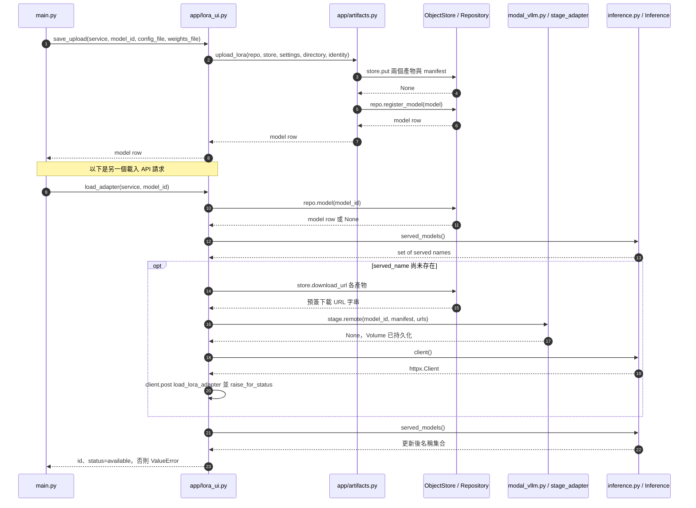

# 第 15 章｜LoRA 產物管理、載入與 A／B 比較

所屬部分：第 4 部分「SFT 與 LoRA 微調實作」

訓練結束只是取得 adapter。要真正比較效果，還必須確保檔案完整、版本相容、端點載入正確，並使用公平的題目與設定。

> 程式碼閱讀方式：本章「專案程式碼」為 2026-10-06 工作區原碼節錄，僅移除共同前置縮排，保留相對縮排與原始換行；片段可能依賴外部變數，不一定可單獨執行。行號以當時原檔為準，程式更新後請由檔案連結與函式名稱核對。

## 本章模組呼叫時序圖：上傳、登錄與載入 adapter 的跨模組呼叫

每條泳道是實際檔案中的模組／物件；標示「套件」或「服務」的是外部依賴。實線箭頭標出呼叫的函式及輸入，虛線箭頭標出回傳資料或例外；自我箭頭表示同一模組內部操作。欄位清單是回傳結構摘要，不是額外的函式參數。



**呼叫與回傳重點：** S 泳道為控制圖寬合併兩個專案物件，箭頭明確標示 store 或 repo。identity 是 model_id、base_model、base_revision 三個參數的縮寫；served_models 回傳 set，不是 API 原始 JSON。

各函式的實際程式碼與原檔連結見下方小節；圖省略無關的 imports、日誌及部分前置檢查，不代表它們未執行。

## 15.1 adapter_config.json 與 adapter_model.safetensors 的內容與用途

`adapter_config.json` 描述 LoRA 類型、rank、alpha、目標模組與基礎模型資訊；`adapter_model.safetensors` 保存 adapter tensor。它們不是完整 Qwen3-8B 權重，不能在沒有基礎模型時獨立生成回答。

目前上傳流程只接受這兩個標準產物，不接受 ZIP 或 pickle 權重。Safetensors 格式有利於以張量資料方式載入，但「檔案能解析」仍不等於所有 tensor 語意、形狀與模型都相容；完整相容性還要在實際載入階段確認。

**專案程式碼（節錄）**

檔案：[app/artifacts.py](<../../../app/artifacts.py>)；位置：`upload_lora`，第 35～45 行。[跳至起始行](<../../../app/artifacts.py#L35>)

<!-- project-code: app/artifacts.py:35-45 -->
```python
weights_path = directory / "adapter_model.safetensors"
if weights_path.stat().st_size > 2 * 1024 ** 3:
    raise ValueError("第一版 adapter 大小上限為 2GB")
from safetensors import safe_open
with safe_open(str(weights_path), framework="numpy") as weights:
    if not list(weights.keys()):
        raise ValueError("adapter 權重不可為空")
files = {"adapter_config.json": config_bytes, "adapter_model.safetensors": weights_path.read_bytes()}
prefix = f"workspaces/{settings.workspace_id}/adapters/{model_id}/{uuid4()}"
manifest = {"base_model": base_model, "base_revision": base_revision,
            "rank": rank, "files": {name: hashlib.sha256(data).hexdigest() for name, data in files.items()}}
```

**閱讀重點：** 讀取標準 safetensors 並建立兩個產物檔案的雜湊 manifest。

## 15.2 Adapter 與基礎模型 revision 的相容性

Adapter 學習的是相對於某份基礎權重的更新。如果換了基礎模型或 revision，即使層名稱與維度相同，更新也不一定仍有相同效果。頁面要求固定 Qwen3-8B revision，並拒絕缺失或不一致的 revision。

通用 CLI 的產物驗證與頁面限制並不完全相同；目前 Modal 頁面要求 rank 上限 64，且底層只接受列出的標準 rank 值。訓練 UI 開放 4、8、16、32。不要把某層較寬的驗證範圍當成整個部署鏈都支援。

**專案程式碼（節錄）**

檔案：[app/lora_ui.py](<../../../app/lora_ui.py>)；位置：`save_upload`，第 25～33 行。[跳至起始行](<../../../app/lora_ui.py#L25>)

<!-- project-code: app/lora_ui.py:25-33 -->
```python
config = json.loads((Path(folder) / 'adapter_config.json').read_text())
if config.get('revision') != REVISION:
    raise ValueError('設定檔須包含與目前基礎模型一致的完整 revision')
if type(config.get('r')) is not int or not 1 <= config['r'] <= 64:
    raise ValueError('頁面載入支援 rank 1～64')
from safetensors import SafetensorError
try:
    return upload_lora(service.repo, service.store, service.settings, folder,
                       model_id, MODEL, REVISION)
```

**閱讀重點：** 頁面先強制 revision 與 rank 範圍，再交由底層 upload_lora 繼續檢查。

## 15.3 SHA-256 校驗、R2 儲存與 Neon 模型登錄

上傳時程式計算兩個檔案的 SHA-256，把檔案及 manifest 放入 R2，再把 model ID、served_name、基礎版本與 artifact prefix 登錄 Neon。下載到 GPU Volume 時再次核對雜湊，避免檔案不完整或同 ID 對應到不同內容。

雜湊確認的是 bytes 一致，不是品質或可信來源的評分。模型 ID 採不可覆寫策略，新實驗使用新 ID。訓練頁「加入測試」可辨識部分重複發布情況，但一般新產物仍應保留獨立版本，不要把同名當作已更新成功。

**專案程式碼（節錄）**

檔案：[app/artifacts.py](<../../../app/artifacts.py>)；位置：`upload_lora`，第 42～51 行。[跳至起始行](<../../../app/artifacts.py#L42>)

<!-- project-code: app/artifacts.py:42-51 -->
```python
files = {"adapter_config.json": config_bytes, "adapter_model.safetensors": weights_path.read_bytes()}
prefix = f"workspaces/{settings.workspace_id}/adapters/{model_id}/{uuid4()}"
manifest = {"base_model": base_model, "base_revision": base_revision,
            "rank": rank, "files": {name: hashlib.sha256(data).hexdigest() for name, data in files.items()}}
for name, data in files.items():
    store.put(f"{prefix}/{name}", data)
store.put(f"{prefix}/manifest.json", json.dumps(manifest).encode(), "application/json")
return repo.register_model({"id": model_id, "kind": "lora", "base_model": base_model,
    "base_revision": base_revision, "served_name": model_id, "artifact_prefix": prefix,
    "manifest": manifest})
```

**閱讀重點：** 先把產物／manifest 寫到 store，再把對應 model metadata 登錄 repo。

## 15.4 「已上傳」「已登錄」「GPU 已載入」三種狀態

已上傳代表 R2 有檔案；已登錄代表 Neon 有模型目錄；已載入代表目前推論端點的 models 列表能找到 served_name。前兩者都不能保證 GPU 已成功接受 adapter。

`model_statuses()` 以端點列表判斷 available；若端點連不上則為 unknown，不應直接判斷檔案遺失。上傳成功但載入失敗時，保留產物可供重試。測試頁要求實際 available，避免使用者以為選到 LoRA，實際卻仍在測原模型。

**專案程式碼（節錄）**

檔案：[app/service.py](<../../../app/service.py>)；位置：`RagService.model_statuses`，第 43～53 行。[跳至起始行](<../../../app/service.py#L43>)

<!-- project-code: app/service.py:43-53 -->
```python
def model_statuses(self):
    models = self.repo.models()
    try:
        served = self.inference.served_models()
        error = None
    except Exception:
        served, error = set(), "無法連接 vLLM 或尚未設定；不能確認模型是否可用"
    for model in models:
        model["status"] = "unknown" if error else (
            "available" if model["served_name"] in served else "stored")
    return {"models": models, "inference_error": error}
```

**閱讀重點：** 資料庫有記錄不等於 available；端點失聯時狀態是 unknown。

## 15.5 vLLM 啟動載入與執行期間動態載入 LoRA

冷啟動時，部署程式掃描 adapter Volume 中的設定檔，以 `--lora-modules` 隨 vLLM 啟動載入。容器已運行時，應用先 stage 產物、commit Volume，再由受驗證的代理 reload Volume 並呼叫動態載入 API。

代理限定模型名稱與 `/adapters/<id>` 路徑，避免瀏覽器任意指定 GPU 檔案位置；載入後再查 models 確認。這兩條路徑都需要相容的 vLLM 配置，背景見 [vLLM LoRA 文件](https://docs.vllm.ai/en/stable/features/lora/)。目前 RunPod 的頁面自動載入尚未實作。

**專案程式碼（節錄）**

檔案：[deploy/modal_vllm.py](<../../../deploy/modal_vllm.py>)；位置：`serve`，第 53～63 行。[跳至起始行](<../../../deploy/modal_vllm.py#L53>)

<!-- project-code: deploy/modal_vllm.py:53-63 -->
```python
os.environ["VLLM_ALLOW_RUNTIME_LORA_UPDATING"] = "True"
args = ["vllm", "serve", MODEL, "--revision", REVISION,
        "--host", "127.0.0.1", "--port", "8000", "--dtype", "auto",
        "--enforce-eager", "--gpu-memory-utilization", "0.90",
        "--max-model-len", "8128", "--max-num-seqs", "1",
        "--enable-lora", "--max-lora-rank", "64", "--max-cpu-loras", "32"]
saved = sorted(p for p in Path("/adapters").glob("*/adapter_config.json") if not p.parent.name.startswith("."))
if saved:
    args += ["--lora-modules", *[json.dumps({"name": p.parent.name,
              "path": str(p.parent), "base_model_name": MODEL}) for p in saved]]
process = subprocess.Popen(args)
```

**閱讀重點：** 冷啟動掃描 Volume，將已有 adapter 以 lora-modules 傳入 vLLM。

**專案程式碼（節錄）**

檔案：[app/lora_ui.py](<../../../app/lora_ui.py>)；位置：`load_adapter`，第 47～59 行。[跳至起始行](<../../../app/lora_ui.py#L47>)

<!-- project-code: app/lora_ui.py:47-59 -->
```python
if model['served_name'] not in service.inference.served_models():
    import modal
    stage = modal.Function.from_name('localize-llm-qwen3', 'stage_adapter', environment_name='main')
    urls = {name: service.store.download_url(model['artifact_prefix'] + '/' + name)
            for name in model['manifest']['files']}
    stage.remote(model['id'], model['manifest'], urls)
    with service.inference.client() as client:
        result = client.post('load_lora_adapter', json={'lora_name': model['id'],
                                                      'lora_path': '/adapters/' + model['id']})
        result.raise_for_status()
if model['served_name'] not in service.inference.served_models():
    raise ValueError('雲端尚未確認 LoRA 可用，請重新載入')
return {'id': model['id'], 'status': 'available'}
```

**閱讀重點：** 動態載入先 stage 檔案，再呼叫端點，最後確認 models 列表。

## 15.6 固定題目與生成設定，比較原模型與微調模型

A 選原模型，B 選實際載入的 adapter，使用同一 case 的 messages、相同 temperature 與输出上限。`run_case()` 明確使用傳入模型，不更動共用預設。記憶題不會把 reference_answer 傳給模型。

同題兩次生成仍可能有變異；正式比較應重複執行，記錄服務版本、請求設定與冷暖狀態。若兩欄選同一模型，只能觀察重複生成差異，不能稱為微調前後比較。RAG 與 LoL 測試的輸入建構不同，也不能混在一起報分數。

**專案程式碼（節錄）**

檔案：[app/lol_lab.py](<../../../app/lol_lab.py>)；位置：`run_case`，第 18～25 行。[跳至起始行](<../../../app/lol_lab.py#L18>)

<!-- project-code: app/lol_lab.py:18-25 -->
```python
model = service.repo.model(model_id)
if not model:
    raise LookupError("模型不存在")
if model["served_name"] not in service.inference.served_models():
    raise ValueError("模型已登錄但推論端點尚未載入；請先部署 adapter")
start = time.monotonic()
answer, usage = service.inference.chat(case["messages"][1:], model,
    system_prompt=case["messages"][0]["content"])
```

**閱讀重點：** 傳入的 model_id 決定此次推論，不需要修改共用預設模型。

## 15.7 分別評閱記憶、依據資料回答、拒答與過度拒答

記憶題看已訓練事實的新問法；理解題看是否依附加 context；拒答題看資訊不足時是否避免猜測。過度拒答則是有證據、有答案卻不回答，應與正確拒答分開。

LoL 頁面的 keyword_match 是每組關鍵字至少命中一個，且所有組都要符合；它與 RAG 評估的全部指定字串檢查不同。兩者都只是文字線索。人工評閱應核對版本、條件與是否加入無根據的額外敘述，並保存 notes。

**專案程式碼（節錄）**

檔案：[app/lol_lab.py](<../../../app/lol_lab.py>)；位置：`run_case`，第 26～34 行。[跳至起始行](<../../../app/lol_lab.py#L26>)

<!-- project-code: app/lol_lab.py:26-34 -->
```python
groups = case["keyword_groups"]
return {"case_id": case_id, "dataset_version": "lol-pilot-v1",
        "model": {k: model[k] for k in ("id", "base_model", "base_revision", "served_name")},
        "messages": case["messages"], "answer": answer, "usage": usage,
        "elapsed_seconds": round(time.monotonic() - start, 3),
        "keyword_match": all(any(term.casefold() in answer.casefold() for term in group)
                             for group in groups) if groups else None,
        "reference_answer": case["reference_answer"], "source_url": case["source_url"],
        "manual_review": {"correct": None, "notes": ""}}
```

**閱讀重點：** keyword_match 為每組至少命中一詞；manual_review 仍須人工填寫。

## 15.8 用專案已記錄的錯誤案例，說明如何判斷訓練成效

既有記錄指出第一題原模型答 13.10、LoRA 答 12.10，而資料參考為 14.22。這次結果顯示兩者都錯，不能把「LoRA 答案不同」當成改善，也不能因訓練 loss 降低就忽略此失敗。

正確下一步是完成完整測試分類統計，檢查更多錯誤與資料覆蓋，再使用開發資料形成新假設。不要直接反覆把這一道 test 答案加進訓練來追分，否則失去衡量效果的獨立性。

**實作界線：** 這是既有實驗結果，不是某段函式保證的輸出。請依本章末的上傳及服務實測紀錄核對；不要把當時回答硬編碼進教學程式當作模型結果。

## 實作練習與判讀

在已有部署的環境，依序完成：上傳／加入測試 → 查看模型目錄 → 載入 → 確認 available → 選 A／B → 執行同題 → 人工標註 → 匯出結果。載入或生成可能喚醒 GPU；只閱讀本章不需要執行這些步驟。

至少挑一題記憶、一題理解、一題拒答，填寫「A 正確、B 正確、引用／context 支持、額外錯誤、耗時」表格。若要形成品質結論，仍需完整測試與重複實驗；三題只用來熟悉流程。離開測試頁前匯出，頁面記憶體中的評閱不是永久資料庫報告。

## 程式碼與延伸閱讀

- [產物與 manifest](../../../app/artifacts.py)
- [頁面上傳與載入](../../../app/lora_ui.py)
- [冷啟動與動態載入代理](../../../deploy/modal_vllm.py)
- [A／B 推論與輔助指標](../../../app/lol_lab.py)
- [上傳及服務實測紀錄](../../lora-upload.md)

[返回教材目錄](../README.md)
