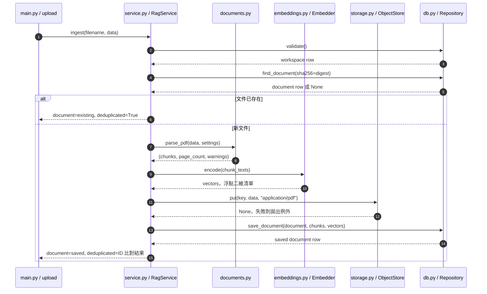

# 第 4 章｜文件解析與切段：建立檢索資料的起點

所屬部分：第 2 部分「建立可核對來源的 RAG 文件問答」

檢索品質的上限受到原始文字品質限制。本章從 PDF 建檔開始，說明目前的簡單切段策略及它不能處理的情況。

> 程式碼閱讀方式：本章「專案程式碼」為 2026-10-06 工作區原碼節錄，僅移除共同前置縮排，保留相對縮排與原始換行；片段可能依賴外部變數，不一定可單獨執行。行號以當時原檔為準，程式更新後請由檔案連結與函式名稱核對。

## 本章模組呼叫時序圖：ingest 跨模組建檔與回傳

每條泳道是實際檔案中的模組／物件；標示「套件」或「服務」的是外部依賴。實線箭頭標出呼叫的函式及輸入，虛線箭頭標出回傳資料或例外；自我箭頭表示同一模組內部操作。欄位清單是回傳結構摘要，不是額外的函式參數。



**呼叫與回傳重點：** chunks 的每筆內容是 page 與 text；vectors 必須與 chunks 一一對應。save_document 也處理同時上傳造成的去重，因此最後的 deduplicated 不是固定 False。parse_pdf 或 encode 失敗會中斷後續保存。

各函式的實際程式碼與原檔連結見下方小節；圖省略無關的 imports、日誌及部分前置檢查，不代表它們未執行。

## 4.1 使用 pypdf 抽取 PDF 文字，保留頁序

`parse_pdf()` 先檢查 PDF 檔頭，再以 `PdfReader` 讀取頁面，呼叫 `page.extract_text()`。程式移除空字元、清理首尾空白，並保留抽取結果中的換行。它拒絕加密 PDF，預設限制最多 300 頁。

頁碼以 `enumerate(reader.pages, 1)` 產生，代表 PDF 第幾頁；封面與目錄也包含在內。因此介面「第 3 頁」不保證等於文件印刷的「第 1 頁」。抽取工具得到文字不代表重建了閱讀順序，雙欄排版與表格需要人工抽查。

**專案程式碼（節錄）**

檔案：[app/documents.py](<../../../app/documents.py>)；位置：`parse_pdf`，第 6～14 行。[跳至起始行](<../../../app/documents.py#L6>)

<!-- project-code: app/documents.py:6-14 -->
```python
def parse_pdf(data, settings):
    if not data.startswith(b"%PDF-"):
        raise ValueError("僅接受 PDF 檔案")
    try:
        reader = PdfReader(BytesIO(data))
        if reader.is_encrypted:
            raise ValueError("目前不接受加密 PDF，請先解密")
        if len(reader.pages) > settings.max_pdf_pages:
            raise ValueError("PDF 超過頁數限制")
```

**閱讀重點：** 先拒絕非 PDF、加密與超頁數檔案，之後才逐頁處理。

## 4.2 專案目前採用的字元切段與重疊策略：預設 1,000 字元、重疊 150 字元

預設 `chunk_chars=1000`、`chunk_overlap=150`，每次前進 850 個字元。若一頁有 2,300 字元，片段約為 `[0:1000]`、`[850:1850]`、`[1700:2700]`，最後一段取到頁尾即可。

重疊能降低句子剛好被切斷的影響，但會增加儲存量與重複檢索。程式要求 overlap 小於 chunk 長度，避免步長為零或負數。此實作按頁切段，並不將前一頁結尾與下一頁開頭自動合併，也沒有依標題或句子邊界切割。

**專案程式碼（節錄）**

檔案：[app/documents.py](<../../../app/documents.py>)；位置：`parse_pdf`，第 15～32 行。[跳至起始行](<../../../app/documents.py#L15>)

<!-- project-code: app/documents.py:15-32 -->
```python
chunks, warnings = [], []
step = settings.chunk_chars - settings.chunk_overlap
if step <= 0:
    raise ValueError("CHUNK_OVERLAP 必須小於 CHUNK_CHARS")
for number, page in enumerate(reader.pages, 1):
    # Keep line breaks and page boundaries; no claims of table reconstruction.
    text = (page.extract_text() or "").replace("\x00", "").strip()
    if len(text) < 20:
        warnings.append(f"第 {number} 頁文字不足，可能是掃描頁、圖片或空白頁，需人工檢查／OCR")
        continue
    for start in range(0, len(text), step):
        part = text[start:start + settings.chunk_chars].strip()
        if part:
            chunks.append({"page": number, "text": part})
        if len(chunks) > settings.max_chunks:
            raise ValueError("文件片段數超過限制")
        if start + settings.chunk_chars >= len(text):
            break
```

**閱讀重點：** step 是切段前進距離；每頁單獨迴圈，片段不會自動跨頁合併。

## 4.3 Chunk 太大或太小如何影響檢索與回答

大 chunk 可能同時含多個主題，向量表示因此不容易聚焦；送往模型的無關文字也增多。小 chunk 比較聚焦，卻可能只保留數值而失去「年份、單位、適用條件」等必要上下文。

例如「每 30 天一次」若與前面的「一般環境濾網清潔」分開，就可能被誤用於重污染環境。調參應觀察證據是否完整、是否命中，以及送入模型後能否回答，而非只追求更高的相似度分數。最佳大小會隨文件類型改變。

**專案程式碼（節錄）**

檔案：[app/config.py](<../../../app/config.py>)；位置：`Settings`，第 29～34 行。[跳至起始行](<../../../app/config.py#L29>)

<!-- project-code: app/config.py:29-34 -->
```python
max_pdf_pages: int = Field(default=300, ge=1)
max_chunks: int = Field(default=3000, ge=1)
chunk_chars: int = Field(default=1000, ge=100, le=2000)
chunk_overlap: int = Field(default=150, ge=0)
retrieval_k: int = Field(default=5, ge=1, le=8)
min_similarity: float = Field(default=0.35, ge=-1, le=1)
```

**閱讀重點：** chunk_chars、chunk_overlap 與 retrieval_k 是不同階段的旋鈕，調整效果需要分開評估。

## 4.4 字元數與 token 數的差別

切段器用 Python 字串長度，embedding 模型限制則以 tokenizer 的 token 計算。數字、英文縮寫、特殊符號密集時，即使字元數相同，token 長度也可能不同。

因此 `Embedder.encode()` 在向量化前，對加上 prompt 的文字計算 token 數。超過預設 2,048 時直接報錯，而非只編碼開頭卻保存完整片段。否則資料庫顯示有某句話，向量實際上卻沒看過它，會使檢索除錯非常困難。

**專案程式碼（節錄）**

檔案：[app/embeddings.py](<../../../app/embeddings.py>)；位置：`Embedder.encode`，第 22～26 行。[跳至起始行](<../../../app/embeddings.py#L22>)

<!-- project-code: app/embeddings.py:22-26 -->
```python
prompt = spec["query_prompt"] if query else spec["document_prompt"]
# Reject silent truncation, which would leave stored text outside the embedding.
for text in texts:
    if len(self._model.tokenizer.encode(prompt + text)) > spec["max_tokens"]:
        raise ValueError("文字超過 embedding token 限制，請縮短問題／CHUNK_CHARS")
```

**閱讀重點：** 長度檢查包含 query／document prompt；超長時報錯而不是靜默截斷。

## 4.5 掃描 PDF、表格、跨頁段落與文字抽取失敗的處理

程式把抽取文字少於 20 字元的頁面列為警告並略過；如果所有頁都無法產生片段，就拒絕建檔。這只是簡單訊號：真正的短頁也可能被略過，掃描頁上若有少量可抽取文字也不代表 OCR 已完成。

目前沒有 OCR、版面辨識或複雜表格重建。跨頁表格、圖說、註腳可能失去關聯。處理方式是先看 warnings 與原 PDF，決定是否另行 OCR 或改用更合適的解析器，再重新建檔；不能靠 prompt 還原從未抽出的資料。

**專案程式碼（節錄）**

檔案：[app/documents.py](<../../../app/documents.py>)；位置：`parse_pdf`，第 19～24 行。[跳至起始行](<../../../app/documents.py#L19>)

<!-- project-code: app/documents.py:19-24 -->
```python
for number, page in enumerate(reader.pages, 1):
    # Keep line breaks and page boundaries; no claims of table reconstruction.
    text = (page.extract_text() or "").replace("\x00", "").strip()
    if len(text) < 20:
        warnings.append(f"第 {number} 頁文字不足，可能是掃描頁、圖片或空白頁，需人工檢查／OCR")
        continue
```

**閱讀重點：** 少於 20 字元是警告與略過條件，不是 OCR 引擎或掃描頁的精確分類器。

## 4.6 文件雜湊去重，以及片段與原始文件的對應

`RagService.ingest()` 對整份 PDF bytes 計算 SHA-256。同 workspace 中相同 bytes 會重用既有文件，避免重複處理；不同 PDF 即使文字看起來一樣，只要 bytes 不同，仍可能被視為不同檔案。

每個 chunk 保存文件 ID、頁序、片段序號、原文與向量，原始 PDF 另放 R2。這些欄位讓引用能回到原檔。要注意：改了 chunk 大小再上傳同一份 PDF，去重可能直接回傳舊資料，並不自動重切；切段實驗應使用隔離的測試索引或明確重新建檔流程。

**專案程式碼（節錄）**

檔案：[app/service.py](<../../../app/service.py>)；位置：`RagService.ingest`，第 19～30 行。[跳至起始行](<../../../app/service.py#L19>)

<!-- project-code: app/service.py:19-30 -->
```python
digest = hashlib.sha256(data).hexdigest()
existing = self.repo.find_document(sha256=digest)
if existing:
    return {"document": existing, "deduplicated": True}
chunks, pages, warnings = parse_pdf(data, self.settings)
vectors = self.embedder.encode([chunk["text"] for chunk in chunks])
key = f"workspaces/{self.settings.workspace_id}/documents/{digest}.pdf"
self.store.put(key, data, "application/pdf")
document = {"id": str(uuid4()), "sha256": digest,
    "filename": PurePosixPath(filename.replace("\\", "/")).name[:240] or "document.pdf",
    "object_key": key, "page_count": pages, "warnings": warnings}
saved = self.repo.save_document(document, chunks, vectors)
```

**閱讀重點：** SHA-256 去重在解析之前；同一原檔會直接返回，不能藉重傳保證重新切段。

## 實作練習與判讀

以下只做本機解析，不會下載模型或呼叫雲端。在專案根目錄執行，先把路徑換成自己的 PDF：

```python
from pathlib import Path
from app.config import Settings
from app.documents import parse_pdf

settings = Settings(chunk_chars=1000, chunk_overlap=150)
chunks, page_count, warnings = parse_pdf(Path("data/sample.pdf").read_bytes(), settings)
print("頁數：", page_count, "片段數：", len(chunks))
print("警告：", warnings)
for chunk in chunks[:3]:
    print(chunk["page"], len(chunk["text"]), repr(chunk["text"][:120]))
```

對照原 PDF 檢查一段有數字的內容，確認主詞、年份與單位都還在。再把長度改成 500，比較片段數與斷句位置。解析成功只能證明取得文字，不能證明後續回答正確。

## 程式碼與延伸閱讀

- [PDF 解析實作](../../../app/documents.py)
- [切段設定](../../../app/config.py)
- [去重與建檔流程](../../../app/service.py)

[返回教材目錄](../README.md)
