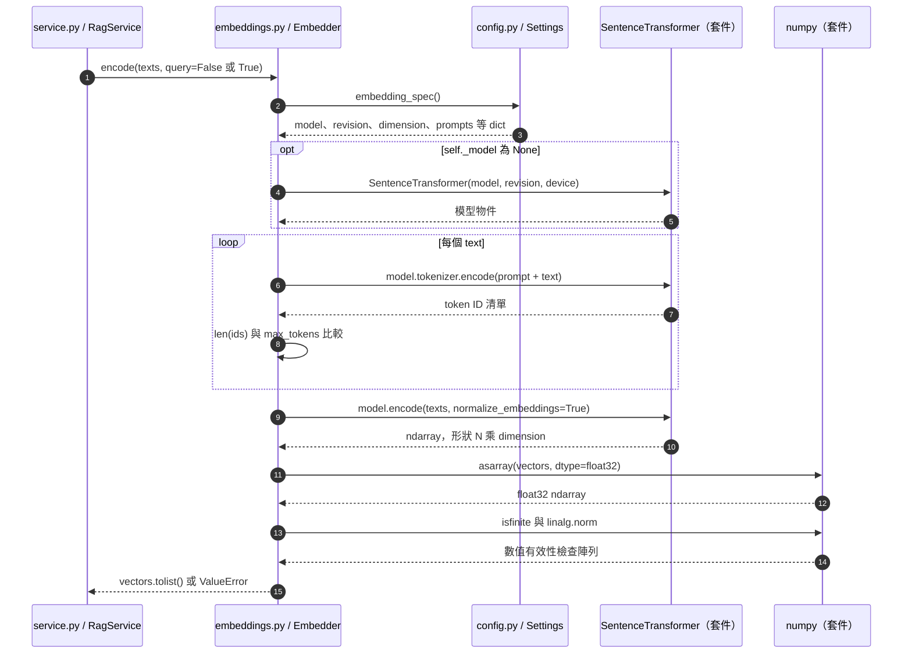

# 第 5 章｜Embedding：把文字轉成可搜尋的向量

所屬部分：第 2 部分「建立可核對來源的 RAG 文件問答」

本章把「語意相近」轉成可以計算與儲存的數值表示。重點是建立一致的向量空間，而不是把向量當成模型答案或文件備份。

> 程式碼閱讀方式：本章「專案程式碼」為 2026-10-06 工作區原碼節錄，僅移除共同前置縮排，保留相對縮排與原始換行；片段可能依賴外部變數，不一定可單獨執行。行號以當時原檔為準，程式更新後請由檔案連結與函式名稱核對。

## 本章模組呼叫時序圖：Embedder.encode 的套件呼叫與資料形狀

每條泳道是實際檔案中的模組／物件；標示「套件」或「服務」的是外部依賴。實線箭頭標出呼叫的函式及輸入，虛線箭頭標出回傳資料或例外；自我箭頭表示同一模組內部操作。欄位清單是回傳結構摘要，不是額外的函式參數。



**呼叫與回傳重點：** N 是輸入文本數。建檔使用整份二維清單；搜尋只取 encode([question], query=True)[0] 作單一查詢向量。所有步驟在同一 Embedder 的 Lock 內執行。

各函式的實際程式碼與原檔連結見下方小節；圖省略無關的 imports、日誌及部分前置檢查，不代表它們未執行。

## 5.1 Embedding 與生成式 LLM 的差別

生成式 LLM 輸出下一個 token 的分布，逐步產生回答；embedding 模型則把一段文字映射成固定長度向量。向量中的每個座標通常沒有可直接命名的自然語言意義，不能說第 17 維就是「年份」。

例如「多久清潔濾網」與「濾網清潔週期」可能在向量空間接近，即使字面不同。這讓語意搜尋能超越完全相同的關鍵字，但模型仍可能混淆相近產品或互相矛盾的句子。向量相似不是邏輯等價，也不是事實查證。

**專案程式碼（節錄）**

檔案：[app/embeddings.py](<../../../app/embeddings.py>)；位置：`Embedder.encode`，第 27～34 行。[跳至起始行](<../../../app/embeddings.py#L27>)

<!-- project-code: app/embeddings.py:27-34 -->
```python
vectors = self._model.encode(texts, prompt=prompt, batch_size=8,
    normalize_embeddings=True, show_progress_bar=False, convert_to_numpy=True)
vectors = np.asarray(vectors, dtype=np.float32)
if vectors.shape != (len(texts), spec["dimension"]):
    raise ValueError("embedding 輸出維度與索引設定不符")
if not np.isfinite(vectors).all() or (np.linalg.norm(vectors, axis=1) == 0).any():
    raise ValueError("embedding 含有無效數值")
return vectors.tolist()
```

**閱讀重點：** 回傳的是數值向量清單，不是生成文字；形狀與有限值檢查保障基本資料有效性。

## 5.2 本專案如何透過 Sentence Transformers 使用 BGE-M3

`Embedder` 採延遲載入：第一次 encode 時才初始化 `SentenceTransformer`，並固定模型 revision、裝置與最大長度。本機預設裝置為 CPU，模型在程序內重用；僅啟動網頁不代表 embedding 已下載或載入完成。

BGE-M3 本身有多種檢索表示能力，但本專案透過一般 `SentenceTransformer.encode()` 使用 dense embedding，沒有實作 sparse 或多向量檢索。不要因模型名稱包含 M3，就把專案說成已具備混合檢索。模型背景可查閱 [BGE-M3 官方模型卡](https://huggingface.co/BAAI/bge-m3)。

**專案程式碼（節錄）**

檔案：[app/embeddings.py](<../../../app/embeddings.py>)；位置：`Embedder.encode`，第 13～21 行。[跳至起始行](<../../../app/embeddings.py#L13>)

<!-- project-code: app/embeddings.py:13-21 -->
```python
def encode(self, texts, query=False):
    with self._lock:
        spec = self.settings.embedding_spec()
        if self._model is None:
            os.environ.setdefault("HF_HOME", self.settings.hf_home)
            from sentence_transformers import SentenceTransformer
            self._model = SentenceTransformer(spec["model"], revision=spec["revision"],
                device=self.settings.embedding_device, trust_remote_code=False)
            self._model.max_seq_length = spec["max_tokens"]
```

**閱讀重點：** _model 為 None 時才載入指定 revision，之後在程序內重用。

## 5.3 1,024 維向量、正規化與 cosine similarity

專案預期每段文字得到 1,024 個數值，並呼叫 `normalize_embeddings=True`。L2 正規化將向量縮放為長度 1；對非零向量，cosine similarity 為 $\frac{u\cdot v}{\|u\|\|v\|}$，正規化後可用內積理解。

例如 $u=(1,0)$、$v=(0.8,0.6)$ 都是單位向量，相似度為 0.8；與 $(0,1)$ 則為 0。這只是二維示意，實際向量是 1,024 維。相似度的數值不是「答案正確機率」；0.8 不能解讀為 80% 正確。

**專案程式碼（節錄）**

檔案：[app/embeddings.py](<../../../app/embeddings.py>)；位置：`Embedder.encode`，第 27～33 行。[跳至起始行](<../../../app/embeddings.py#L27>)

<!-- project-code: app/embeddings.py:27-33 -->
```python
vectors = self._model.encode(texts, prompt=prompt, batch_size=8,
    normalize_embeddings=True, show_progress_bar=False, convert_to_numpy=True)
vectors = np.asarray(vectors, dtype=np.float32)
if vectors.shape != (len(texts), spec["dimension"]):
    raise ValueError("embedding 輸出維度與索引設定不符")
if not np.isfinite(vectors).all() or (np.linalg.norm(vectors, axis=1) == 0).any():
    raise ValueError("embedding 含有無效數值")
```

**閱讀重點：** normalize_embeddings=True 做正規化，shape 驗證確認維度與文本數一致。

## 5.4 文件向量與問題向量如何產生

建檔時，程式把每個 chunk 傳給 `encode(texts)`；搜尋時則用 `encode([question], query=True)`。二者選擇不同設定欄位：`document_prompt` 與 `query_prompt`，目前預設都為空字串。

問題與文件必須使用相容的模型與編碼規則，才能在同一空間比較。假設文件用模型 A、問題用模型 B，即使輸出都是 1,024 維，也不能假設座標意義相同。若模型要求查詢前綴，也應記錄進設定，不能只有某一台電腦偷偷加入。

**專案程式碼（節錄）**

檔案：[app/embeddings.py](<../../../app/embeddings.py>)；位置：`Embedder.encode`，第 22～28 行。[跳至起始行](<../../../app/embeddings.py#L22>)

<!-- project-code: app/embeddings.py:22-28 -->
```python
prompt = spec["query_prompt"] if query else spec["document_prompt"]
# Reject silent truncation, which would leave stored text outside the embedding.
for text in texts:
    if len(self._model.tokenizer.encode(prompt + text)) > spec["max_tokens"]:
        raise ValueError("文字超過 embedding token 限制，請縮短問題／CHUNK_CHARS")
vectors = self._model.encode(texts, prompt=prompt, batch_size=8,
    normalize_embeddings=True, show_progress_bar=False, convert_to_numpy=True)
```

**閱讀重點：** query 決定使用哪種 prompt；文件與問題仍經過同一個模型。

## 5.5 批次編碼、模型快取與 token 長度檢查

專案設定 `batch_size=8`，讓模型一次處理一小批文本；這通常比逐條呼叫更有效率，但可用批次大小仍受硬體與文字長度影響。程序以 Lock 保護載入與編碼，因此目前同一 Embedder 不會無限制並行執行。

編碼前先用 tokenizer 檢查長度，編碼後確認陣列形狀為 `(文本數, 維度)`，且沒有 NaN、無限值或零向量。模型檔案快取與 `_model` 不同：前者在磁碟減少重複下載，後者在記憶體減少重複初始化。重啟程式可能保留下載快取，但仍需載入模型。

**專案程式碼（節錄）**

檔案：[app/embeddings.py](<../../../app/embeddings.py>)；位置：`Embedder.encode`，第 13～21 行。[跳至起始行](<../../../app/embeddings.py#L13>)

<!-- project-code: app/embeddings.py:13-21 -->
```python
def encode(self, texts, query=False):
    with self._lock:
        spec = self.settings.embedding_spec()
        if self._model is None:
            os.environ.setdefault("HF_HOME", self.settings.hf_home)
            from sentence_transformers import SentenceTransformer
            self._model = SentenceTransformer(spec["model"], revision=spec["revision"],
                device=self.settings.embedding_device, trust_remote_code=False)
            self._model.max_seq_length = spec["max_tokens"]
```

**閱讀重點：** Lock 保護載入與編碼流程；HF_HOME 是磁碟快取位置，_model 是記憶體物件。

## 5.6 Embedding fingerprint 為什麼包含模型版本、維度與編碼設定

`Settings.embedding_spec()` 包含模型名稱、40 位 revision、維度、正規化、最大 token 數、兩種 prompt 與 encoding 標記。程式將排序後的 JSON 做 SHA-256，得到 fingerprint，並與 workspace 中保存的值比較。

這是一道相容性檢查，能避免不同電腦用不同設定混寫索引；它不會量測 embedding 品質。切段長度沒有包含在這個 fingerprint 內，因此重現實驗還需要另外保存 chunk 設定與實際片段。不能只憑 fingerprint 相同就宣稱兩次檢索資料完全一致。

**專案程式碼（節錄）**

檔案：[app/config.py](<../../../app/config.py>)；位置：`Settings.embedding_spec／embedding_fingerprint`，第 53～64 行。[跳至起始行](<../../../app/config.py#L53>)

<!-- project-code: app/config.py:53-64 -->
```python
    return {
        "model": self.embedding_model, "revision": self.embedding_revision.lower(),
        "dimension": self.embedding_dimension, "normalize": True,
        "max_tokens": self.embedding_max_tokens,
        "query_prompt": self.embedding_query_prompt,
        "document_prompt": self.embedding_document_prompt,
        "encoding": "sentence-transformers-encode-v1",
    }

def embedding_fingerprint(self):
    value = json.dumps(self.embedding_spec(), sort_keys=True).encode()
    return hashlib.sha256(value).hexdigest()
```

**閱讀重點：** 編碼規格被序列化後雜湊；這份字典未包含 chunk_chars。

## 5.7 更換 embedding 設定後，為什麼通常需要重新建檔

換模型、revision 或 prompt 可能改變整個向量空間。只更新查詢端會讓新問題與舊向量失配；只對部分文件重編碼則會混用空間。正確做法是保留舊實驗資料，在新索引／workspace 中以一致設定重新產生所有文件向量，再比較結果。

即使只是改最大 token 上限而沒有改變短文本輸出，本專案仍保守地將其視為設定差異並拒絕混用。不要為了通過檢查手動改資料庫 fingerprint，卻不確認向量來源；那會移除系統用來防止錯配的證據。

**專案程式碼（節錄）**

檔案：[app/db.py](<../../../app/db.py>)；位置：`Repository._validate`，第 32～41 行。[跳至起始行](<../../../app/db.py#L32>)

<!-- project-code: app/db.py:32-41 -->
```python
def _validate(self, conn):
    row = conn.execute("SELECT * FROM rag_workspaces WHERE id=%s", (self.workspace,)).fetchone()
    if not row:
        raise ValueError("工作區尚未初始化，請執行 python -m app.cli init-db")
    if row["embedding_fingerprint"] != self.settings.embedding_fingerprint():
        raise ValueError("本機 embedding 設定與雲端索引不一致；請同步設定，不能混用向量")
    if (row["bucket_name"] != self.settings.r2_bucket_name or
            row["storage_endpoint"] != self.settings.r2_endpoint_url.rstrip("/")):
        raise ValueError("本機 R2 設定與共用工作區不一致")
    return row
```

**閱讀重點：** fingerprint 不一致就拒絕共用索引，不會自動幫舊向量重新編碼。

## 實作練習與判讀

不下載模型也能先驗證相似度直覺：

```python
import numpy as np
u = np.array([1.0, 0.0])
v = np.array([0.8, 0.6])
print(float(u @ v / (np.linalg.norm(u) * np.linalg.norm(v))))
```

預期輸出 0.8。完成模型設定後，可把同義問題、不同產品問題與相反敘述各做向量化，列出兩兩相似度。若反義句也很接近，應解釋為「主題相近」，不可直接判定 embedding 無效；檢索仍需要後續語意判讀。首次實際 encode 可能下載固定版本模型。

## 程式碼與延伸閱讀

- [Embedding 載入與檢查](../../../app/embeddings.py)
- [Embedding spec 與 fingerprint](../../../app/config.py)
- [工作區相容性驗證](../../../app/db.py)

[返回教材目錄](../README.md)
