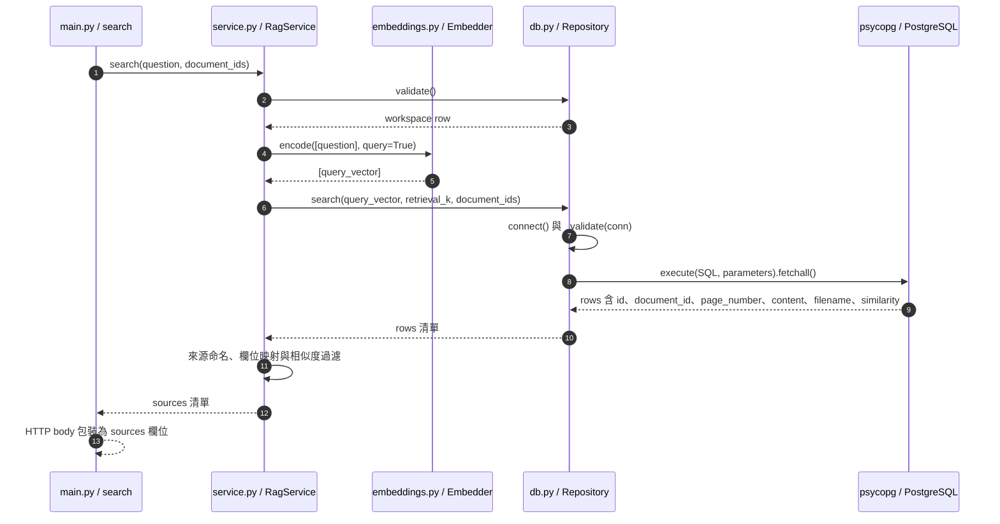

# 第 6 章｜向量檢索：使用 Neon 與 pgvector 找到證據

所屬部分：第 2 部分「建立可核對來源的 RAG 文件問答」

本章把向量搜尋拆成 SQL 排序、範圍限制與門檻過濾。理解每一步後，才能知道找不到答案是「根本沒存進去」還是「排名與門檻不合適」。

> 程式碼閱讀方式：本章「專案程式碼」為 2026-10-06 工作區原碼節錄，僅移除共同前置縮排，保留相對縮排與原始換行；片段可能依賴外部變數，不一定可單獨執行。行號以當時原檔為準，程式更新後請由檔案連結與函式名稱核對。

## 本章模組呼叫時序圖：search 如何組合 Embedder 與 Repository

每條泳道是實際檔案中的模組／物件；標示「套件」或「服務」的是外部依賴。實線箭頭標出呼叫的函式及輸入，虛線箭頭標出回傳資料或例外；自我箭頭表示同一模組內部操作。欄位清單是回傳結構摘要，不是額外的函式參數。



**呼叫與回傳重點：** Repository.search 回傳的是資料庫欄位；RagService.search 再把 content 改成 text、page_number 改成 page，加入 source_id 與 chunk_id。最後 main.search 才包成 {sources: ...}，不要混淆這三層回傳格式。

各函式的實際程式碼與原檔連結見下方小節；圖省略無關的 imports、日誌及部分前置檢查，不代表它們未執行。

## 6.1 文件、片段、向量與來源 metadata 的儲存關係

`rag_documents` 保存文件 ID、workspace、檔名、R2 object key 與頁數；`rag_chunks` 保存片段 ID、文件 ID、頁碼、ordinal、原文與 embedding。查詢時 JOIN 文件表，就能把向量結果還原成使用者看得懂的來源。

目前 schema 建立文件 ID 索引，但沒有建立 HNSW 或 IVFFlat 向量索引。搜尋仍可用 pgvector 的距離運算排序；不要把「使用向量資料庫」等同於「已採近似最近鄰加速」。資料量增加後才需要依延遲、召回與查詢計畫評估索引方案。

**專案程式碼（節錄）**

檔案：[app/schema.sql](<../../../app/schema.sql>)；位置：`rag_chunks 資料表`，第 21～30 行。[跳至起始行](<../../../app/schema.sql#L21>)

<!-- project-code: app/schema.sql:21-30 -->
```sql
CREATE TABLE IF NOT EXISTS rag_chunks (
    id uuid PRIMARY KEY,
    document_id uuid NOT NULL REFERENCES rag_documents(id) ON DELETE CASCADE,
    page_number integer NOT NULL,
    ordinal integer NOT NULL,
    content text NOT NULL,
    embedding vector NOT NULL,
    UNIQUE(document_id, ordinal)
);
CREATE INDEX IF NOT EXISTS rag_chunks_document ON rag_chunks(document_id);
```

**閱讀重點：** 同時存原文、頁碼與向量；這裡建立的是 document_id 索引，沒有近似向量索引。

## 6.2 解讀專案的 cosine distance SQL

`<=>` 是 pgvector 的 cosine distance 運算子；專案用 `1 - distance` 當 similarity，並依距離遞增排序。這讓最相近片段排在前面。運算子的定義可參考 [pgvector 官方文件](https://github.com/pgvector/pgvector)。

下列是專案查詢的簡化示意，`:query_vector` 是說明用參數，不能原樣當 psycopg SQL 執行：

```sql
SELECT content, 1 - (embedding <=> :query_vector) AS similarity
FROM rag_chunks
ORDER BY embedding <=> :query_vector, id
LIMIT 5;
```

實際程式還 JOIN 文件、檢查 workspace 與文件範圍，並使用 psycopg `%s` 參數繫結。第二排序鍵 id 讓同距離結果有穩定的排序規則，不代表相同內容一定取得相同 UUID。

**專案程式碼（節錄）**

檔案：[app/db.py](<../../../app/db.py>)；位置：`Repository.search`，第 80～89 行。[跳至起始行](<../../../app/db.py#L80>)

<!-- project-code: app/db.py:80-89 -->
```python
def search(self, vector, limit, document_ids):
    with self.connect() as conn:
        self._validate(conn)
        return conn.execute("""SELECT c.id, c.document_id, c.page_number, c.content,
            d.filename, 1-(c.embedding <=> %s::vector) AS similarity
            FROM rag_chunks c JOIN rag_documents d ON d.id=c.document_id
            WHERE d.workspace_id=%s AND (%s::uuid[] IS NULL OR d.id=ANY(%s::uuid[]))
            ORDER BY c.embedding <=> %s::vector, c.id LIMIT %s""",
            (json.dumps(vector), self.workspace, document_ids, document_ids,
             json.dumps(vector), limit)).fetchall()
```

**閱讀重點：** <=> 排序的是距離，1-distance 才是回傳的 similarity。

## 6.3 Top-k 與最低相似度門檻：目前預設為 5 與 0.35

資料庫先取最相近的 k 筆，服務層再刪掉 similarity 低於門檻的候選。預設 k=5、門檻 0.35，所以最後可能只有 0～5 筆。門檻不會強迫資料庫找出至少一筆結果，也不是經過校準的信心分數。

例如前五筆分數是 0.72、0.58、0.36、0.31、0.22，最後保留前三筆。提高門檻會更容易拒答；降低門檻可能增加雜訊。提高 k 可增加找到跨段證據的機會，但會擴大 prompt、延遲與干擾。這些取捨須由測試題驗證。

**專案程式碼（節錄）**

檔案：[app/service.py](<../../../app/service.py>)；位置：`RagService.search`，第 33～41 行。[跳至起始行](<../../../app/service.py#L33>)

<!-- project-code: app/service.py:33-41 -->
```python
def search(self, question, document_ids=None):
    self.repo.validate()
    vector = self.embedder.encode([question], query=True)[0]
    rows = self.repo.search(vector, self.settings.retrieval_k, document_ids)
    return [{"source_id": f"S{i + 1}", "chunk_id": str(row["id"]),
             "document_id": str(row["document_id"]), "filename": row["filename"],
             "page": row["page_number"], "text": row["content"],
             "similarity": row["similarity"]}
            for i, row in enumerate(rows) if row["similarity"] >= self.settings.min_similarity]
```

**閱讀重點：** repo 先取 retrieval_k，服務層再依 min_similarity 過濾。

## 6.4 文件範圍與 workspace 篩選

查詢會用 `workspace_id` 篩選文件，並在提供 `document_ids` 時只查指定集合。限制範圍必須發生在選取候選時，否則先全域排名再隱藏不該看的結果，可能既洩漏資料又漏掉範圍內的有效候選。

本專案是受信任 workspace 模式，持有工作區 key 的使用者共用資料，並不是每個人有獨立文件 ACL。Workspace 篩選是現有資料邊界，不能宣稱已有完整多租戶隔離。正式擴充權限時還需處理上傳、查詢、引用原文與原檔下載等路徑。

**專案程式碼（節錄）**

檔案：[app/db.py](<../../../app/db.py>)；位置：`Repository.search`，第 83～89 行。[跳至起始行](<../../../app/db.py#L83>)

<!-- project-code: app/db.py:83-89 -->
```python
return conn.execute("""SELECT c.id, c.document_id, c.page_number, c.content,
    d.filename, 1-(c.embedding <=> %s::vector) AS similarity
    FROM rag_chunks c JOIN rag_documents d ON d.id=c.document_id
    WHERE d.workspace_id=%s AND (%s::uuid[] IS NULL OR d.id=ANY(%s::uuid[]))
    ORDER BY c.embedding <=> %s::vector, c.id LIMIT %s""",
    (json.dumps(vector), self.workspace, document_ids, document_ids,
     json.dumps(vector), limit)).fetchall()
```

**閱讀重點：** workspace 與 document_ids 寫在 WHERE，先限制資料範圍再取候選。

## 6.5 漏掉正確片段、找到不相關片段時，如何定位原因

先確認原 PDF 的答案有沒有被抽出並存入 chunk。若缺失，調 k 不會修復解析問題。若已存入，再查看它在查詢中的排名與分數，確認是否被門檻排除、是否因文件範圍選錯而不可見。

若只找到相似主題而非正確事實，檢查產品名、年份、否定詞與單位是否在同一片段。也可能是大量重疊 chunk 佔據前幾名，使另一頁必要證據被擠掉。先閱讀實際片段，再考慮去重、reranking 或混合搜尋；後三者不能誤寫成現成功能。

**專案程式碼（節錄）**

檔案：[app/service.py](<../../../app/service.py>)；位置：`RagService.search`，第 37～41 行。[跳至起始行](<../../../app/service.py#L37>)

<!-- project-code: app/service.py:37-41 -->
```python
return [{"source_id": f"S{i + 1}", "chunk_id": str(row["id"]),
         "document_id": str(row["document_id"]), "filename": row["filename"],
         "page": row["page_number"], "text": row["content"],
         "similarity": row["similarity"]}
        for i, row in enumerate(rows) if row["similarity"] >= self.settings.min_similarity]
```

**閱讀重點：** 檢查回傳 text、page、similarity，能區分片段內容不足與門檻問題。

## 6.6 如何用題庫調整檢索參數，而非把預設值視為最佳值

準備有標註來源的 validation 題庫，固定文件、embedding 與 prompt，先比較例如 k=3、5、8，再比較門檻。每次保存檢索片段與設定，衡量頁面 recall、無答案題誤取結果、最終答案品質與延遲。

不要在同一次實驗同時更換 embedding、切段與 k，否則無法知道改善來自何處。也不要反覆用最後的 test 題目調參；保留測試集作最終確認。預設 0.35 是程式起點，不是所有中文文件通用的最佳值。

**專案程式碼（節錄）**

檔案：[app/evaluation.py](<../../../app/evaluation.py>)；位置：`run_evaluation`，第 111～115 行。[跳至起始行](<../../../app/evaluation.py#L111>)

<!-- project-code: app/evaluation.py:111-115 -->
```python
emit({"type": "configuration", "workspace_id": rag.settings.workspace_id,
      "embedding_fingerprint": rag.settings.embedding_fingerprint(),
      "retrieval_k": rag.settings.retrieval_k, "min_similarity": rag.settings.min_similarity,
      "prompt_version": PROMPT_VERSION,
      "system_prompt_sha256": hashlib.sha256(SYSTEM_PROMPT.encode()).hexdigest(), "models": models})
```

**閱讀重點：** 每次報告保存 k、門檻與 embedding fingerprint，方便核對控制變因。

## 實作練習與判讀

用紙筆模擬候選：A 頁 0.62、B 頁 0.41、A 頁另一片段 0.39、C 頁 0.34。若 k=3、門檻 0.35，會保留三個片段但只有兩個不同頁面；若預期來源是 A、C，頁面 recall 為 1/2。

再改成 k=4、門檻 0.30，頁面 recall 變成 1，但不能由此推論答案一定正確，因為多出的內容也可能讓模型混淆。實際操作可使用第 10 章批次評估，對照結果中的 `retrieved_sources`。

## 程式碼與延伸閱讀

- [SQL 與 scope 篩選](../../../app/db.py)
- [資料表與目前索引](../../../app/schema.sql)
- [門檻過濾](../../../app/service.py)

[返回教材目錄](../README.md)
