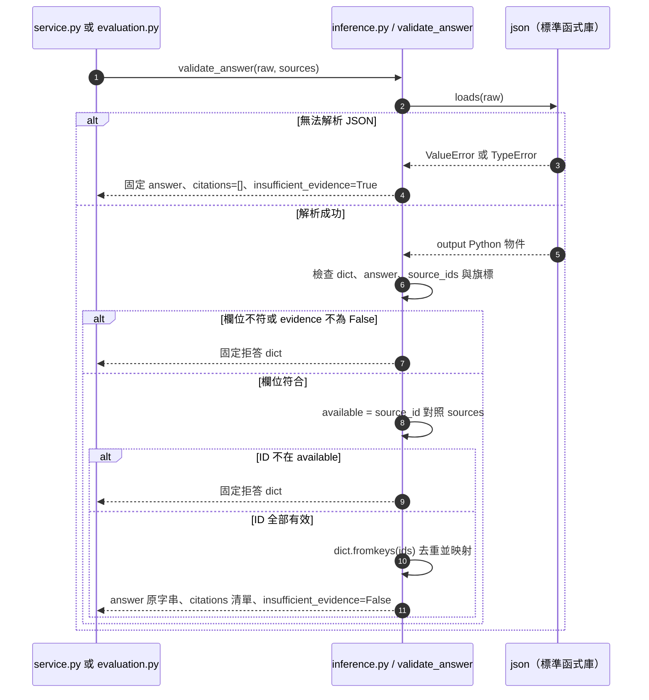

# 第 8 章｜結構化輸出、來源引用與回答驗證

所屬部分：第 2 部分「建立可核對來源的 RAG 文件問答」

結構化輸出讓程式可以穩定讀取答案，但結構有效與事實正確是兩件事。本章逐項拆解目前驗證器的保證範圍。

> 程式碼閱讀方式：本章「專案程式碼」為 2026-10-06 工作區原碼節錄，僅移除共同前置縮排，保留相對縮排與原始換行；片段可能依賴外部變數，不一定可單獨執行。行號以當時原檔為準，程式更新後請由檔案連結與函式名稱核對。

## 本章模組呼叫時序圖：validate_answer 接收與回傳的結構

每條泳道是實際檔案中的模組／物件；標示「套件」或「服務」的是外部依賴。實線箭頭標出呼叫的函式及輸入，虛線箭頭標出回傳資料或例外；自我箭頭表示同一模組內部操作。欄位清單是回傳結構摘要，不是額外的函式參數。



**呼叫與回傳重點：** sources 是呼叫方傳入的物件清單，沒有查資料庫的副作用。citations 由 sources 取出原物件；驗證器沒有另一個模型或函式幫忙查核語意。

各函式的實際程式碼與原檔連結見下方小節；圖省略無關的 imports、日誌及部分前置檢查，不代表它們未執行。

## 8.1 模型輸出的 JSON 欄位：answer、source_ids、insufficient_evidence

模型被要求回傳三個欄位：`answer` 是顯示文字，`source_ids` 是支持回答的來源清單，`insufficient_evidence` 表示是否證據不足。成功回答的最小示例為：

```json
{"answer":"一般環境每 30 天清潔一次。","source_ids":["S1"],"insufficient_evidence":false}
```

布林值必須是 JSON 的 `false`，不是字串 `"false"`。來源清單要包含字串 ID，不可把頁碼直接放進去。驗證後應用程式回傳的是 `citations` 完整物件，與原始模型 JSON 格式不同。

**專案程式碼（節錄）**

檔案：[app/inference.py](<../../../app/inference.py>)；位置：`validate_answer`，第 73～81 行。[跳至起始行](<../../../app/inference.py#L73>)

<!-- project-code: app/inference.py:73-81 -->
```python
output = json.loads(raw)
if not isinstance(output, dict):
    return refusal
ids = output.get("source_ids")
answer = output.get("answer")
if (output.get("insufficient_evidence") is not False or not isinstance(answer, str)
        or not answer.strip() or not isinstance(ids, list) or not ids
        or not all(isinstance(value, str) for value in ids)):
    return refusal
```

**閱讀重點：** 逐項驗證 answer、source_ids 與 evidence flag，而非只相信合法 JSON。

## 8.2 JSON 格式要求與應用程式驗證的分工

推論請求使用 `response_format={"type":"json_object"}`，要求服務產生 JSON 物件。這不等同於明確的 JSON Schema 欄位約束，更不等於內容正確。程式仍用 `json.loads()` 解碼，再檢查欄位值與來源集合。

模型可能回傳合法 JSON，但 `answer` 是空字串、source_ids 是數字，或 evidence flag 缺失。伺服器不能只因 HTTP 200 就當作可用答案。相反地，API 連線錯誤是執行失敗，與取得輸出後被驗證器拒絕不同。

**專案程式碼（節錄）**

檔案：[app/inference.py](<../../../app/inference.py>)；位置：`Inference.answer`，第 30～41 行。[跳至起始行](<../../../app/inference.py#L30>)

<!-- project-code: app/inference.py:30-41 -->
```python
def answer(self, question, sources, model):
    payload = {
        "model": model["served_name"],
        "messages": [
            {"role": "system", "content": SYSTEM_PROMPT},
            {"role": "user", "content": json.dumps({"question": question, "sources": sources},
                                                     ensure_ascii=False)},
        ],
        "max_tokens": 1200,
        "temperature": 0.2,
        "response_format": {"type": "json_object"},
    }
```

**閱讀重點：** json_object 只在請求端要求物件輸出，欄位檢查仍由應用處理。

## 8.3 假造來源 ID、缺少引用、格式錯誤的處理

`validate_answer()` 要求 evidence flag 恰好為 False、答案是非空字串、來源清單非空且每一個 ID 都是字串。任何 ID 不在本次來源集合中，就把整份輸出轉成固定拒答，不採「只保留合法 ID」的方式局部接受。

這使 `S999` 等捏造來源無法顯示為有效引用。JSON 解碼失敗、輸出不是物件或缺少來源，也會走拒答。若同一 ID 重複出現，程式去重並保留順序。這些檢查沒有評估 answer 裡的數字或推論是否由來源支持。

**專案程式碼（節錄）**

檔案：[app/inference.py](<../../../app/inference.py>)；位置：`validate_answer`，第 76～88 行。[跳至起始行](<../../../app/inference.py#L76>)

<!-- project-code: app/inference.py:76-88 -->
```python
    ids = output.get("source_ids")
    answer = output.get("answer")
    if (output.get("insufficient_evidence") is not False or not isinstance(answer, str)
            or not answer.strip() or not isinstance(ids, list) or not ids
            or not all(isinstance(value, str) for value in ids)):
        return refusal
    available = {source["source_id"]: source for source in sources}
    if any(value not in available for value in ids):
        return refusal
    return {"answer": answer, "citations": [available[value] for value in dict.fromkeys(ids)],
            "insufficient_evidence": False}
except (ValueError, TypeError):
    return refusal
```

**閱讀重點：** 缺欄位、來源不存在或解碼例外都轉為 refusal；合法引用會去重。

## 8.4 如何將來源 ID 還原成檔名、頁碼與原文

驗證器建立 `{source_id: source}` 對照表，把模型回傳的 ID 映射回原本的 source 物件。引用中的檔名、頁碼與原文因此來自檢索資料，不是讓模型自由編寫。

例如模型回傳 S1，應用程式可顯示「設備維護手冊.pdf，第 3 頁」和片段原文。PDF 頁序與印刷頁碼可能不同；檔名也可能不唯一，真正資料關聯依 document ID。核對時應看原文條件，而不只看檔名似乎相關。

**專案程式碼（節錄）**

檔案：[app/inference.py](<../../../app/inference.py>)；位置：`validate_answer`，第 82～86 行。[跳至起始行](<../../../app/inference.py#L82>)

<!-- project-code: app/inference.py:82-86 -->
```python
available = {source["source_id"]: source for source in sources}
if any(value not in available for value in ids):
    return refusal
return {"answer": answer, "citations": [available[value] for value in dict.fromkeys(ids)],
        "insufficient_evidence": False}
```

**閱讀重點：** citations 從 available 對照表取出完整物件，檔名與頁碼不是由模型自由產生。

## 8.5 區分「引用存在」與「引用確實支持答案」

假設 S1 原文是「每 30 天清潔」，模型回答「每 60 天清潔」且引用 S1，當前驗證器仍會接受，因為結構與 ID 都有效。這正是「引用存在」不能代表「語意支持」的原因。

語意支持檢查要看結論、年份、單位與適用對象是否吻合；跨段推論還需要核對推理是否合理。未來可加人工或模型輔助判讀，但那會引入額外成本與誤判，不能把目前的 ID 驗證描述成完整事實查核。

**專案程式碼（節錄）**

檔案：[app/inference.py](<../../../app/inference.py>)；位置：`validate_answer`，第 82～86 行。[跳至起始行](<../../../app/inference.py#L82>)

<!-- project-code: app/inference.py:82-86 -->
```python
available = {source["source_id"]: source for source in sources}
if any(value not in available for value in ids):
    return refusal
return {"answer": answer, "citations": [available[value] for value in dict.fromkeys(ids)],
        "insufficient_evidence": False}
```

**閱讀重點：** 判斷的是來源 ID 存在與否，這段沒有核對 answer 中的事實。

## 8.6 如何區分模型主動拒答與格式驗證失敗造成的拒答

模型若回傳 `insufficient_evidence=true`，屬於明確表示證據不足；若模型其實寫了答案卻回傳壞 JSON，應用程式也會顯示同一句固定拒答。因此畫面上的拒答率混合了多種原因。

批次評估保存 `raw_answer`，可用來區分兩者：原始 flag 為 true、來源為空、欄位錯誤、引用不存在等。一般問答紀錄主要保存驗證後結果，不能假設它同樣保留原始生成內容。評估拒答能力時應查看原始輸出，避免把格式失敗當成審慎拒答。

**專案程式碼（節錄）**

檔案：[app/evaluation.py](<../../../app/evaluation.py>)；位置：`run_evaluation`，第 134～140 行。[跳至起始行](<../../../app/evaluation.py#L134>)

<!-- project-code: app/evaluation.py:134-140 -->
```python
try:
    raw, usage = rag.inference.answer(case.question, sources, model) if sources else ("{}", {})
    result = validate_answer(raw, sources)
    record.update(status="ok", result=result, raw_answer=raw, usage=usage,
                  metrics=score(case, sources, result),
                  manual_review={"answer_correct": None, "citations_supported": None,
                                 "notes": ""})
```

**閱讀重點：** raw_answer 與 result 同時保存；拒答成因需要回看原始輸出。

## 實作練習與判讀

這個練習可離線執行，不需要模型或資料庫：

```python
import json
from app.inference import validate_answer

sources = [{"source_id": "S1", "text": "每 30 天清潔一次。", "page": 3}]
for answer, ids in [("每 30 天清潔一次。", ["S1"]),
                    ("每 60 天清潔一次。", ["S1"]),
                    ("每 30 天清潔一次。", ["S999"])]:
    raw = json.dumps({"answer": answer, "source_ids": ids,
                      "insufficient_evidence": False})
    print(validate_answer(raw, sources))
```

前兩筆都會通過結構檢查，第三筆拒答。請解釋第二筆為什麼仍是錯誤答案，以及哪一層需要新增檢查才能發現它。

## 程式碼與延伸閱讀

- [回答驗證器](../../../app/inference.py)
- [評估原始輸出與拒答指標](../../../app/evaluation.py)

[返回教材目錄](../README.md)
