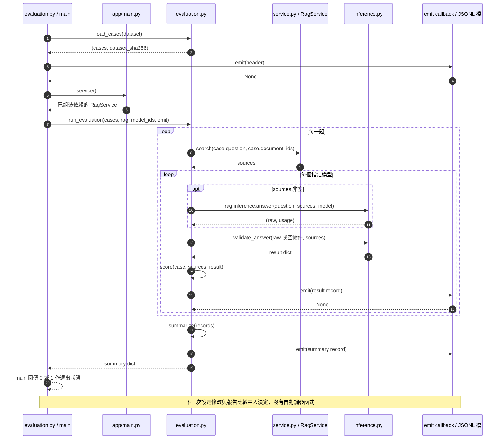

# 第 16 章｜端到端實驗：選擇正確的改善方法

所屬部分：第 5 部分「整合與延伸」

本章把前面的技術組成一次可檢查的實驗。目標是能提出有限、可重現的結論，而不是用更多工具掩蓋問題。

> 程式碼閱讀方式：本章「專案程式碼」為 2026-10-06 工作區原碼節錄，僅移除共同前置縮排，保留相對縮排與原始換行；片段可能依賴外部變數，不一定可單獨執行。行號以當時原檔為準，程式更新後請由檔案連結與函式名稱核對。

## 本章模組呼叫時序圖：一次評估如何形成可比較的完整報告

每條泳道是實際檔案中的模組／物件；標示「套件」或「服務」的是外部依賴。實線箭頭標出呼叫的函式及輸入，虛線箭頭標出回傳資料或例外；自我箭頭表示同一模組內部操作。欄位清單是回傳結構摘要，不是額外的函式參數。



**呼叫與回傳重點：** 這張圖把本章的實驗方法落到現有 CLI 呼叫鏈：題庫 SHA、依賴組裝、逐筆輸出與 summary。圖中呈現成功主路徑；例外會另寫 error record，細節見第 10 章。人工選下一次參數不畫成程式自動呼叫。

各函式的實際程式碼與原檔連結見下方小節；圖省略無關的 imports、日誌及部分前置檢查，不代表它們未執行。

## 16.1 完成一次「建立基線 → 找出問題 → 修改 → 重新評估」

先明確定義成功條件，例如「真實維護文件中的數值題能答對、引用可支持、無答案時拒答」，而不是只寫「模型更聰明」。固定一份開發題庫，記錄基線及錯誤案例，再提出一個可被推翻的假設。

例如假設「漏答來自 k 太小」，就固定文件、embedding 與 prompt，只把 k 從 3 改為 5，比較來源 recall、最終正確性與延遲。若 recall 沒變，就不應宣稱假設成立。參數選好後，再用未參與調整的 test 做最終確認。

**專案程式碼（節錄）**

檔案：[app/evaluation.py](<../../../app/evaluation.py>)；位置：`run_evaluation`，第 111～115 行。[跳至起始行](<../../../app/evaluation.py#L111>)

<!-- project-code: app/evaluation.py:111-115 -->
```python
emit({"type": "configuration", "workspace_id": rag.settings.workspace_id,
      "embedding_fingerprint": rag.settings.embedding_fingerprint(),
      "retrieval_k": rag.settings.retrieval_k, "min_similarity": rag.settings.min_similarity,
      "prompt_version": PROMPT_VERSION,
      "system_prompt_sha256": hashlib.sha256(SYSTEM_PROMPT.encode()).hexdigest(), "models": models})
```

**閱讀重點：** 先保存控制條件，再比較結果，才能追蹤這次到底改了什麼。

## 16.2 判斷問題來自解析、切段、embedding、檢索、prompt 或模型行為

| 現象 | 優先查看 | 可能改善方向 |
| --- | --- | --- |
| 原文不在任何 chunk | PDF 抽取與 warnings | OCR／解析方式 |
| 只有數值，缺少條件 | chunk 邊界 | 切段與上下文保留 |
| 證據已存，但排名很低 | 向量設定、scope、排名 | 查詢、embedding 或檢索策略 |
| 找到證據卻用錯年份 | 實際 prompt 與 raw_answer | 提示、資料組織、生成能力 |
| 正確答案被轉成拒答 | JSON 與 source_ids | 輸出格式與驗證相容性 |
| 訓練 loss 低但測試差 | split、mask、分類結果 | 資料覆蓋與過擬合檢查 |

這張表是排查起點，不是自動診斷器。例如「模型答錯年份」也可能源自解析把年份排到錯行，因此要沿著原檔到回答的證據鏈逐層查看。

**專案程式碼（節錄）**

檔案：[app/evaluation.py](<../../../app/evaluation.py>)；位置：`run_evaluation`，第 130～146 行。[跳至起始行](<../../../app/evaluation.py#L130>)

<!-- project-code: app/evaluation.py:130-146 -->
```python
started = time.monotonic()
if retrieval_error:
    record.update(status="error", error_stage="retrieval", error_type=retrieval_error)
else:
    try:
        raw, usage = rag.inference.answer(case.question, sources, model) if sources else ("{}", {})
        result = validate_answer(raw, sources)
        record.update(status="ok", result=result, raw_answer=raw, usage=usage,
                      metrics=score(case, sources, result),
                      manual_review={"answer_correct": None, "citations_supported": None,
                                     "notes": ""})
    except Exception as exc:
        # Exception messages may contain API credentials or connection strings.
        record.update(status="error", error_stage="inference", error_type=type(exc).__name__)
record["inference_seconds"] = round(time.monotonic() - started, 3)
records.append(record)
emit(record)
```

**閱讀重點：** retrieval／inference 錯誤與 raw_answer 都留下線索，供逐層排查。

## 16.3 何時優先改善 RAG，何時值得投入 LoRA

若資料常變、要求來源，且現有模型拿到正確片段就能回答，優先改善 RAG 比重新訓練更直接。若模型反覆無法遵守固定格式、領域表達或特定任務流程，且已有足夠可靠示範資料，才值得評估 LoRA。

兩者可以結合：RAG 提供當下事實，LoRA 調整使用證據的行為。但本專案的 LoL pilot 訓練目標不等於已驗證能改善 PDF RAG。要宣稱組合有效，需設計對應任務資料，並比較 base、base+RAG、LoRA、LoRA+RAG 等實驗條件。

**實作界線：** 本節是實驗決策方法。RAG 與 LoRA 的現有實作分別見第 7 章與第 13～14 章；目前沒有一個函式會自動判斷應選哪種方法。

## 16.4 模型、資料、prompt、套件與產物的版本追蹤

每次實驗至少記錄：run ID、程式 commit 或工作樹狀態、模型 revision、資料 SHA、切段設定、embedding fingerprint、prompt 版本、生成設定、套件版本、adapter 雜湊，以及評估題庫與報告位置。

專案已在多個產物保存其中部分欄位，但沒有單一工具自動涵蓋全部，因此需要實驗筆記補齊。不要覆寫舊報告或把不同版本資料共用同名 adapter。相同 seed 也不能取代上述記錄。

```text
實驗：retrieval-k5-001
假設：增加候選可找回跨頁證據
控制：相同文件、embedding、prompt、生成模型
唯一變更：retrieval_k 3 → 5
觀察：頁面 recall、人工正確率、拒答、延遲
結論：填入結果與失敗案例，不先預設成功
```

**專案程式碼（節錄）**

檔案：[training/lora.py](<../../../training/lora.py>)；位置：`train`，第 83～93 行。[跳至起始行](<../../../training/lora.py#L83>)

<!-- project-code: training/lora.py:83-93 -->
```python
output = Path(output_root) / config.run_id
output.mkdir(parents=True, exist_ok=False)
train_path, val_path = Path(data_dir) / "train.jsonl", Path(data_dir) / "validation.jsonl"
rows, validation = read_split(train_path), read_split(val_path)
metadata = {"config": asdict(config), "status": "starting", "dataset": {
    "train_sha256": file_hash(train_path), "validation_sha256": file_hash(val_path),
    "train_rows": len(rows), "validation_rows": len(validation)},
    "test_used_for_training": False, "method": "SFT + BF16 LoRA", "enable_thinking": False}
meta_path = output / "run.json"
meta_path.write_text(json.dumps(metadata, indent=2))
persist()
```

**閱讀重點：** run ID 不可覆寫，資料雜湊在真正訓練前寫入 run.json。

**專案程式碼（節錄）**

檔案：[training/lora.py](<../../../training/lora.py>)；位置：`train`，第 169～175 行。[跳至起始行](<../../../training/lora.py#L169>)

<!-- project-code: training/lora.py:169-175 -->
```python
metadata.update({"status": "completed", "initial_eval_loss": baseline_loss,
    "final_eval_loss": final["eval_loss"], "train_metrics": result.metrics,
    "elapsed_seconds": time.monotonic() - started,
    "adapter_files": {p.name: file_hash(p) for p in adapter.iterdir() if p.is_file()},
    "best_checkpoint": trainer.state.best_model_checkpoint,
    "gpu_peak_allocated_gib": torch.cuda.max_memory_allocated() / 1024**3})
meta_path.write_text(json.dumps(metadata, indent=2))
```

**閱讀重點：** 完成時補上 adapter 雜湊與最佳 checkpoint，讓模型產物能追溯。

## 16.5 訓練與推論資源分離，以及成本紀錄

訓練與推論是不同 Modal App／工作，可能同時占用不同 GPU 並各自產生成本。停止本機瀏覽器或訓練頁不代表停止雲端工作；切換推論供應商也不會關掉原來的 RunPod。

成本筆記應包含排程與啟動時間、GPU 工作時段、Volume／物件儲存、失敗重試與實際帳單。以「一次改善實驗的總成本」比較方案，比只看單次回答延遲更合理。本文不使用固定價格假設；實際執行前依平台當時方案與帳單核對。

**專案程式碼（節錄）**

檔案：[deploy/modal_train.py](<../../../deploy/modal_train.py>)；位置：`train_job`，第 17～22 行。[跳至起始行](<../../../deploy/modal_train.py#L17>)

<!-- project-code: deploy/modal_train.py:17-22 -->
```python
@app.function(image=image, gpu=["L40S", "A100-40GB"], cpu=4, memory=32768,
              volumes={"/model-cache": cache, "/runs": runs}, timeout=3600,
              max_containers=1, retries=0)
def train_job(config):
    from training.lora import TrainConfig, train
    return train(TrainConfig(**config), "/dataset", "/runs", persist=runs.commit)
```

**閱讀重點：** 訓練有獨立資源與 timeout；這段沒有自動停止推論 App 的操作。

## 16.6 延伸方向：OCR、混合檢索、reranker、QLoRA 與更嚴謹的泛化測試；清楚標示它們尚未在本專案實作

OCR 用於掃描頁文字擷取；混合檢索結合向量語意與關鍵字訊號；reranker 對候選問題配對重新排序；QLoRA 以量化基礎權重降低微調記憶體需求。這些是不同層次的改進，不能互相替代，也都不是目前專案已完成的功能。

較嚴謹的泛化測試則需要未見文件／事實分組、多種問法、不同難度、足夠拒答題、重複生成與人工一致性檢查。擴充前先為目前弱點建立可重現案例，新增功能後用同一開發基準檢查，最後再以保留測試集確認。

只有當證據支持時，才把結論從「流程成功」提升成「此任務品質改善」。例如 GPU 訓練完成、adapter 可載入、權重有變動，都屬工程成功；它們不能代替實際回答評閱。

**實作界線：** 本節列的是尚未實作的延伸方向，因此沒有對應專案原始碼可節錄。新增技術時才應補上實作及驗證，避免把概念示意誤當成功能已完成。

## 實作練習與判讀

完成一份實驗報告，內容包含問題定義、資料與版本、基線、唯一變更、結果表、三個失敗案例與結論限制。可先使用既有報告，不必為了練習重新啟動 GPU。

合格的結論示例：「在這份開發題庫中，提高 k 找回了部分跨頁來源，但有兩題仍因單位解讀錯誤而失敗；尚未在保留測試集驗證。」這比只寫「RAG 效果變好」更有用，因為下一步能直接針對單位判讀設計實驗。

## 程式碼與延伸閱讀

- [RAG 評估工具](../../../app/evaluation.py)
- [訓練設定與產物](../../../training/lora.py)
- [驗證紀錄與界線](../../verification.md)
- [既有 LoRA 實驗](../../lora-training.md)
- [返回專案操作說明](../../getting-started.md)

[返回教材目錄](../README.md)
