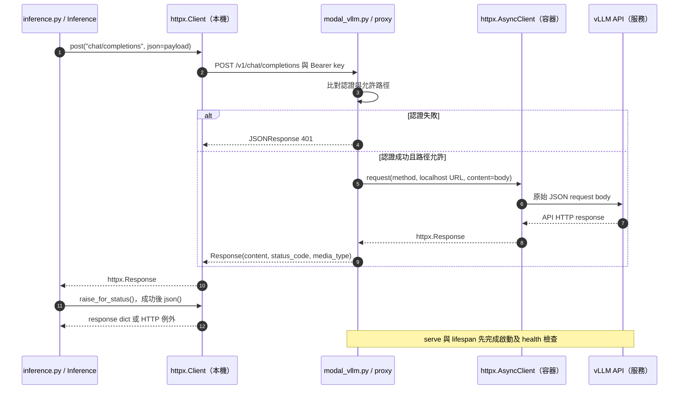

# 第 9 章｜vLLM 與雲端 GPU 推論部署

所屬部分：第 3 部分「模型推論與品質評估」

本章以目前部署程式說明如何讓 Mac 呼叫雲端生成模型。所有資源數值都是專案設定或既有觀測，不代表平台最新價格、可用量或效能承諾。

> 程式碼閱讀方式：本章「專案程式碼」為 2026-10-06 工作區原碼節錄，僅移除共同前置縮排，保留相對縮排與原始換行；片段可能依賴外部變數，不一定可單獨執行。行號以當時原檔為準，程式更新後請由檔案連結與函式名稱核對。

## 本章模組呼叫時序圖：本機 HTTP client 與 Modal 代理的互動

每條泳道是實際檔案中的模組／物件；標示「套件」或「服務」的是外部依賴。實線箭頭標出呼叫的函式及輸入，虛線箭頭標出回傳資料或例外；自我箭頭表示同一模組內部操作。欄位清單是回傳結構摘要，不是額外的函式參數。



**呼叫與回傳重點：** 此圖展開真實 proxy 函式，不把平台排程當成本機函式。served_models 使用 GET models 走同一代理；RunPod 不經 deploy/modal_vllm.py 的 proxy。

各函式的實際程式碼與原檔連結見下方小節；圖省略無關的 imports、日誌及部分前置檢查，不代表它們未執行。

## 9.1 vLLM 的用途，以及它與訓練工具的分工

vLLM 在此負責載入模型、管理推論記憶體、處理生成請求並提供 HTTP 端點。它是推論服務；本專案的梯度計算與 adapter 訓練由另一個 Transformers Trainer 工作處理。

因此「把 LoRA 檔案交給 vLLM」是使用已訓練好的更新，不是啟動訓練。推論容器與訓練容器使用不同套件環境，Mac 的應用環境也不安裝 CUDA/vLLM。這避免為了部署 GPU 而破壞本機文件處理依賴。

**專案程式碼（節錄）**

檔案：[deploy/modal_vllm.py](<../../../deploy/modal_vllm.py>)；位置：`serve`，第 54～63 行。[跳至起始行](<../../../deploy/modal_vllm.py#L54>)

<!-- project-code: deploy/modal_vllm.py:54-63 -->
```python
args = ["vllm", "serve", MODEL, "--revision", REVISION,
        "--host", "127.0.0.1", "--port", "8000", "--dtype", "auto",
        "--enforce-eager", "--gpu-memory-utilization", "0.90",
        "--max-model-len", "8128", "--max-num-seqs", "1",
        "--enable-lora", "--max-lora-rank", "64", "--max-cpu-loras", "32"]
saved = sorted(p for p in Path("/adapters").glob("*/adapter_config.json") if not p.parent.name.startswith("."))
if saved:
    args += ["--lora-modules", *[json.dumps({"name": p.parent.name,
              "path": str(p.parent), "base_model_name": MODEL}) for p in saved]]
process = subprocess.Popen(args)
```

**閱讀重點：** 啟動的是 vllm serve 推論程序，不是 Trainer 訓練工作。

## 9.2 OpenAI-compatible API、模型列表與聊天請求

`Inference.client()` 將 base URL 與 Bearer key 組成 HTTP client。`GET /v1/models` 列出服務實際載入的名稱，`POST /v1/chat/completions` 提交 model 與 messages，回傳 choices 及可能存在的 usage。

OpenAI-compatible 表示此處沿用 API 形狀，不代表模型由 OpenAI 提供，也不保證所有擴充參數都一致。Neon 登錄的 model ID 是應用識別，`served_name` 才是傳給推論端點的 model 值；只有在端點列表中找到，應用才視為可用。

**專案程式碼（節錄）**

檔案：[app/inference.py](<../../../app/inference.py>)；位置：`Inference.client／served_models`，第 18～28 行。[跳至起始行](<../../../app/inference.py#L18>)

<!-- project-code: app/inference.py:18-28 -->
```python
def client(self):
    self.settings.require("vllm_base_url", "vllm_api_key")
    return httpx.Client(base_url=self.settings.vllm_base_url.rstrip("/") + "/",
        headers={"Authorization": "Bearer " + self.settings.vllm_api_key.get_secret_value()},
        timeout=self.settings.llm_timeout_seconds)

def served_models(self):
    with self.client() as client:
        result = client.get("models")
        result.raise_for_status()
        return {model["id"] for model in result.json()["data"]}
```

**閱讀重點：** HTTP client 加認證與 timeout，models 列表反映端點實際提供的名稱。

## 9.3 RunPod 與 Modal 在專案中的部署方式

RunPod 路徑把服務部署在租用的 GPU 主機；操作者管理啟停。Modal 路徑以 Python 定義映像、GPU、Volume 與函式，並提供 HTTPS 端點。Mac、Neon、R2 與 embedding 流程可保持一致。

`deploy/select_backend.py` 切換本機端點設定，但不會關閉另一個供應商的 GPU，也不是自動故障轉移。頁面上的 adapter 自動載入目前只支援 Modal；RunPod 可用 prepare-model 流程準備檔案與指令。端點相容不代表生命週期操作完全相同。

**專案程式碼（節錄）**

檔案：[deploy/select_backend.py](<../../../deploy/select_backend.py>)；位置：`main`，第 28～32 行。[跳至起始行](<../../../deploy/select_backend.py#L28>)

<!-- project-code: deploy/select_backend.py:28-32 -->
```python
set_key(destination, "VLLM_BASE_URL", url)
set_key(destination, "VLLM_API_KEY", key)
if not args.save_current:
    set_key(destination, "LLM_TIMEOUT_SECONDS", "600" if args.backend == "modal" else "180")
print(f"{args.backend} profile {'saved' if args.save_current else 'selected'}; restart Uvicorn to apply.")
```

**閱讀重點：** 切換只更新本機 endpoint、key 與 timeout，沒有停止另一供應商資源的呼叫。

## 9.4 模型快取、冷啟動、健康檢查與 API timeout

Modal 的 CPU 下載函式先把固定 revision 模型放入快取 Volume，減少 GPU 啟動時重複下載。GPU 容器啟動後仍需把權重載入記憶體、初始化執行環境，並等內部 `/health` 就緒，才能接受推論。

冷啟動可能包含排程、容器啟動與模型載入；已有磁碟快取不代表沒有冷啟動。Mac 的 HTTP timeout、Modal startup timeout 與函式 timeout 是不同層次的限制。某層 timeout 不一定表示遠端工作立即停止，應檢查平台工作狀態而非盲目重試。

**專案程式碼（節錄）**

檔案：[deploy/modal_vllm.py](<../../../deploy/modal_vllm.py>)；位置：`serve.lifespan`，第 66～79 行。[跳至起始行](<../../../deploy/modal_vllm.py#L66>)

<!-- project-code: deploy/modal_vllm.py:66-79 -->
```python
async def lifespan(api):
    async with httpx.AsyncClient(timeout=600) as client:
        for _ in range(420):
            if process.poll() is not None:
                raise RuntimeError("vLLM startup failed")
            try:
                r = await client.get("http://127.0.0.1:8000/health")
                if r.status_code == 200:
                    break
            except httpx.HTTPError:
                pass
            await asyncio.sleep(2)
        else:
            raise RuntimeError("vLLM startup timeout")
```

**閱讀重點：** 代理等待內部 health 成功才就緒；程序退出與啟動超時會報錯。

## 9.5 解讀 context 長度、GPU 記憶體比例與並行數設定

目前 Modal 參數包括 `--max-model-len 8128`、`--max-num-seqs 1`、`--gpu-memory-utilization 0.90`、`--enforce-eager`，並限制最多一個容器及同時一個輸入。這是偏向小規模實驗的設定。

GPU memory utilization 是 vLLM 記憶體預算設定，不是「GPU 使用率 90%」或「只會計費 90%」。max-num-seqs 限制同時處理序列數；增加它可能提高吞吐，也可能提高 KV cache 壓力。enforce-eager 選擇執行方式，不能當作普遍加速開關；調整應測量冷啟動、穩態延遲與記憶體。

**專案程式碼（節錄）**

檔案：[deploy/modal_vllm.py](<../../../deploy/modal_vllm.py>)；位置：`serve`，第 54～58 行。[跳至起始行](<../../../deploy/modal_vllm.py#L54>)

<!-- project-code: deploy/modal_vllm.py:54-58 -->
```python
args = ["vllm", "serve", MODEL, "--revision", REVISION,
        "--host", "127.0.0.1", "--port", "8000", "--dtype", "auto",
        "--enforce-eager", "--gpu-memory-utilization", "0.90",
        "--max-model-len", "8128", "--max-num-seqs", "1",
        "--enable-lora", "--max-lora-rank", "64", "--max-cpu-loras", "32"]
```

**閱讀重點：** 這些啟動參數分別限制長度、序列數、記憶體預算與 adapter rank。

## 9.6 Modal 閒置縮到零與持久 Volume 的運作

`min_containers=0`、`max_containers=1`、`scaledown_window=120` 是此專案設定，允許服務閒置後縮到零。再次請求可能重新啟動 GPU。這不是精確到秒的停機保證，也不代表 Volume 會被刪除。

模型快取與 adapter 存在持久 Volume，冷啟動時重新讀取；新增 adapter 時則需 commit 與 reload 讓資料可見。不要把容器本機暫存檔當成永久產物，否則縮到零後可能遺失。訓練輸出另外放在 training-runs Volume。

**專案程式碼（節錄）**

檔案：[deploy/modal_vllm.py](<../../../deploy/modal_vllm.py>)；位置：`serve 的 Modal decorators`，第 35～42 行。[跳至起始行](<../../../deploy/modal_vllm.py#L35>)

<!-- project-code: deploy/modal_vllm.py:35-42 -->
```python
@app.function(image=image, gpu=["L40S", "A100-40GB"], cpu=4, memory=16384,
              volumes={"/model-cache": cache, "/adapters": adapters},
              secrets=[modal.Secret.from_name("localize-llm-vllm")],
              min_containers=0, max_containers=1, scaledown_window=120,
              timeout=600, startup_timeout=900)
@modal.concurrent(max_inputs=1)
@modal.asgi_app()
def serve():
```

**閱讀重點：** min_containers=0 允許縮到零，Volume 掛載與容器生命週期是不同配置。

## 9.7 請求延遲、模型載入時間與 GPU 計費時間的差別

應用記錄的請求耗時通常包含網路等待與可能的冷啟動；純生成速度需要另外量測生成 token 與穩態耗時。既有首次探測紀錄約 109.52 秒，包含冷啟動，不能當作每次回答都需這麼久。

GPU 費用還可能包含啟動、保溫與閒置時間，另有持久儲存。Token usage 適合追蹤請求大小，不能直接換算整台租用 GPU 的帳單。實驗報告應同時記錄應用延遲與平台資源生命週期，再用實際帳單核對成本。

**專案程式碼（節錄）**

檔案：[app/service.py](<../../../app/service.py>)；位置：`RagService.ask`，第 79～83 行。[跳至起始行](<../../../app/service.py#L79>)

<!-- project-code: app/service.py:79-83 -->
```python
result.update({"model": snapshot, "usage": usage,
               "elapsed_seconds": round(time.monotonic() - started, 3),
               "prompt_version": PROMPT_VERSION})
result["run_id"] = self.repo.save_run(question, result, snapshot, PROMPT_VERSION)
return result
```

**閱讀重點：** elapsed_seconds 量的是此服務流程耗時；此處沒有租用帳單或 GPU 單價計算。

## 實作練習與判讀

先做靜態導讀，不啟動 GPU：在 `deploy/modal_vllm.py` 找出模型 revision、映像 digest、timeout、Volume 與併發設定，寫出每項解決的問題。

真實驗證前需完成平台登入、Secret、模型下載與工作區設定。順序是：確認端點可認證 → 核對 models → 一次短對話 → 同一請求再次執行 → 比較冷與暖狀態耗時。這些呼叫可能喚醒計費 GPU；不要把單元測試通過當成雲端部署已驗證。

## 程式碼與延伸閱讀

- [Modal 推論與代理](../../../deploy/modal_vllm.py)
- [本機 HTTP client](../../../app/inference.py)
- [供應商切換工具](../../../deploy/select_backend.py)
- [既有部署與驗證紀錄](../../modal-deployment.md)

[返回教材目錄](../README.md)
