# 第 10 章｜RAG 評估：如何知道系統真的有改善

所屬部分：第 3 部分「模型推論與品質評估」

評估要回答「哪個環節改善、改善多少、代價為何」。本章使用既有 JSONL 評估工具，避免把一次成功回答當成整體品質證明。

> 程式碼閱讀方式：本章「專案程式碼」為 2026-10-06 工作區原碼節錄，僅移除共同前置縮排，保留相對縮排與原始換行；片段可能依賴外部變數，不一定可單獨執行。行號以當時原檔為準，程式更新後請由檔案連結與函式名稱核對。

## 本章模組呼叫時序圖：run_evaluation 如何固定來源並 emit 結果

每條泳道是實際檔案中的模組／物件；標示「套件」或「服務」的是外部依賴。實線箭頭標出呼叫的函式及輸入，虛線箭頭標出回傳資料或例外；自我箭頭表示同一模組內部操作。欄位清單是回傳結構摘要，不是額外的函式參數。

```mermaid
sequenceDiagram
    autonumber
    participant C as evaluation.py / main
    participant E as evaluation.py / run_evaluation
    participant S as service.py / RagService
    participant I as inference.py
    participant F as main 內的 emit
    C->>C: load_cases(dataset)
    Note right of C: 回傳 (cases, dataset_sha256)
    C->>E: run_evaluation(cases, rag, model_ids, emit)
    E->>E: 驗證 workspace 與 served models
    E->>F: emit(configuration)
    F-->>E: None，已寫入並 flush
    loop 每一題
        E->>S: search(case.question, case.document_ids)
        S-->>E: sources
        loop 每個 model
            opt sources 非空
                E->>I: rag.inference.answer(question, sources, model)
                I-->>E: (raw, usage)
            end
            E->>I: validate_answer(raw 或空物件, sources)
            I-->>E: result dict
            E->>E: score(case, sources, result)
            Note right of E: 回傳四項自動 metrics
            E->>F: emit(record 含 raw、result、metrics)
            F-->>E: None
        end
    end
    E->>E: summarize(records)
    E->>F: emit(summary record)
    E-->>C: summary，按 model_id 分組
```



**呼叫與回傳重點：** 圖示成功主路徑；搜尋或推論例外會寫 error record 並繼續。emit 是 main 內的 callback，不是雲端服務，回傳 None，產出是 JSONL 檔案的副作用。

各函式的實際程式碼與原檔連結見下方小節；圖省略無關的 imports、日誌及部分前置檢查，不代表它們未執行。

## 10.1 建立直接查找、跨段整理、數字與無答案題庫

題庫至少涵蓋四種需求：可直接從一頁找到答案、需要整合多段、涉及數字或單位、文件根本沒有答案。中英文與容易混淆的年份也應出現。題目要來自實際文件，不能把範本 UUID 當成有效資料。

每題記錄唯一 id、question、category、expected_refusal；有答案時加 expected_sources，必要時加 answer_contains 與 reference_answer。參考答案供評閱，不傳給模型。來源 page 以 PDF 頁序為準，否則會把正確檢索誤判成失敗。

**專案程式碼（節錄）**

檔案：[app/evaluation.py](<../../../app/evaluation.py>)；位置：`EvaluationCase`，第 21～30 行。[跳至起始行](<../../../app/evaluation.py#L21>)

<!-- project-code: app/evaluation.py:21-30 -->
```python
class EvaluationCase(BaseModel):
    model_config = ConfigDict(extra="forbid", str_strip_whitespace=True)
    id: str = Field(min_length=1)
    category: str = Field(min_length=1)
    question: str = Field(min_length=1, max_length=2000)
    document_ids: list[UUID] | None = Field(default=None, min_length=1, max_length=50)
    expected_refusal: StrictBool
    expected_sources: list[ExpectedSource] = Field(default_factory=list)
    answer_contains: list[str] = Field(default_factory=list)
    reference_answer: str = ""
```

**閱讀重點：** 題庫明確區分預期拒答、來源、字串與人工參考答案。

## 10.2 區分檢索品質、生成品質與引用品質

檢索品質看證據是否進入候選；生成品質看結論是否正確；引用品質看所列原文是否支持結論。三者可能不一致：模型可能憑記憶答對卻引用錯，或取得正確頁面卻讀錯單位。

除錯要保留各層資料，而不是只看最終平均分。對「有答案但拒答」的題目，先看 retrieved_sources，再看 raw_answer，最後看驗證後結果，才能區分檢索漏失、模型拒答與格式錯誤。

**專案程式碼（節錄）**

檔案：[app/evaluation.py](<../../../app/evaluation.py>)；位置：`run_evaluation`，第 134～146 行。[跳至起始行](<../../../app/evaluation.py#L134>)

<!-- project-code: app/evaluation.py:134-146 -->
```python
    try:
        raw, usage = rag.inference.answer(case.question, sources, model) if sources else ("{}", {})
        result = validate_answer(raw, sources)
        record.update(status="ok", result=result, raw_answer=raw, usage=usage,
                      metrics=score(case, sources, result),
                      manual_review={"answer_correct": None, "citations_supported": None,
                                     "notes": ""})
    except Exception as exc:
        # Exception messages may contain API credentials or connection strings.
        record.update(status="error", error_stage="inference", error_type=type(exc).__name__)
record["inference_seconds"] = round(time.monotonic() - started, 3)
records.append(record)
emit(record)
```

**閱讀重點：** 保存原始輸出、驗證結果、指標與錯誤階段，避免只看一個總分。

## 10.3 專案的頁面檢索 recall、引用 recall、拒答判斷與關鍵字檢查

`retrieval_page_recall` 是預期不同文件頁面中被檢索到的比例；`citation_page_recall` 則看被答案引用的比例。同一頁多個 chunk 不重複加分。預期兩頁、找到一頁，就是 0.5。

`refusal_correct` 比較實際 evidence flag 與預期是否一致；`answer_terms_present` 檢查所有指定字串是否出現。未指定來源或字串時，對應值是 null，不當成零，summary 同時保存實際分母 count。錯誤列另外計入 errors，不混成正確拒答。

**專案程式碼（節錄）**

檔案：[app/evaluation.py](<../../../app/evaluation.py>)；位置：`score`，第 65～81 行。[跳至起始行](<../../../app/evaluation.py#L65>)

<!-- project-code: app/evaluation.py:65-81 -->
```python
def score(case, sources, result):
    expected = {(str(s.document_id), s.page) for s in case.expected_sources}

    def recall(rows):
        if not expected:
            return None
        actual = {(str(s["document_id"]), s["page"]) for s in rows}
        return len(actual & expected) / len(expected)

    return {
        "refusal_correct": result["insufficient_evidence"] == case.expected_refusal,
        "retrieval_page_recall": recall(sources),
        "citation_page_recall": recall(result["citations"]),
        "answer_terms_present": (all(term.casefold() in result["answer"].casefold()
                                     for term in case.answer_contains)
                                 if case.answer_contains else None),
    }
```

**閱讀重點：** 頁面以集合去重；沒有標註時回傳 None，而不是零分。

## 10.4 為什麼字串命中不能代表語意正確

若預期字串是「30」，「不是 30，而是 60」也會命中。反過來，「三十天」可能語意正確，卻未包含數字「30」。因此關鍵字檢查是篩選線索，不能替代人工判斷。

引用 recall 也有相同限制：引用到預期頁面不代表論述正確；引用別的有效頁面也可能被標為未命中。專案把列出的每個預期頁面都當成應命中目標，而非可互相替代的來源群組，題庫作者需要理解這個計分定義。

**專案程式碼（節錄）**

檔案：[app/evaluation.py](<../../../app/evaluation.py>)；位置：`score`，第 74～81 行。[跳至起始行](<../../../app/evaluation.py#L74>)

<!-- project-code: app/evaluation.py:74-81 -->
```python
return {
    "refusal_correct": result["insufficient_evidence"] == case.expected_refusal,
    "retrieval_page_recall": recall(sources),
    "citation_page_recall": recall(result["citations"]),
    "answer_terms_present": (all(term.casefold() in result["answer"].casefold()
                                 for term in case.answer_contains)
                             if case.answer_contains else None),
}
```

**閱讀重點：** answer_terms_present 只做 casefold 後字串包含，不做語意或否定詞推理。

## 10.5 同一次評估如何讓不同模型使用相同檢索片段

`run_evaluation()` 每題只呼叫一次搜尋，再依序讓指定模型用相同 sources 生成。這控制住當次檢索差異，也不會修改 workspace 的共用預設模型。

若不同模型必須分開部署，就需要分次評估；工具目前不支援跨次讀入凍結片段，分次會重新搜尋。因此應核對索引狀態、設定與報告中的實際片段，不能只因問題相同就稱為完全控制的比較。

**專案程式碼（節錄）**

檔案：[app/evaluation.py](<../../../app/evaluation.py>)；位置：`run_evaluation`，第 117～129 行。[跳至起始行](<../../../app/evaluation.py#L117>)

<!-- project-code: app/evaluation.py:117-129 -->
```python
for case in cases:
    started = time.monotonic()
    try:
        sources = rag.search(case.question, case.document_ids)
        retrieval_error = None
    except Exception as exc:
        sources, retrieval_error = [], type(exc).__name__
    retrieval_seconds = time.monotonic() - started
    for model in models:
        record = {"type": "result", "case_id": case.id, "category": case.category,
                  "case": case.model_dump(mode="json"), "model_id": model["id"],
                  "model": model, "retrieved_sources": sources,
                  "retrieval_seconds": round(retrieval_seconds, 3)}
```

**閱讀重點：** 搜尋在模型迴圈外，所以同一題不同模型使用同一份 sources。

## 10.6 記錄 prompt、模型、資料與索引版本，保持比較公平

報告 header 保存題庫 SHA-256，configuration 保存模型快照、embedding fingerprint、k、門檻、prompt 版本與 system prompt 雜湊。每筆 result 保存題目、片段、原始輸出、驗證結果、usage 與耗時。

還應以實驗筆記補足工具未完整保存的條件，例如套件版本、切段設定與服務端生成預設。輸出使用新檔名避免覆寫；每筆寫入後 flush，中斷時可讀既有結果，但可能沒有 summary，且目前不提供自動續跑。

**專案程式碼（節錄）**

檔案：[app/evaluation.py](<../../../app/evaluation.py>)；位置：`run_evaluation`，第 111～115 行。[跳至起始行](<../../../app/evaluation.py#L111>)

<!-- project-code: app/evaluation.py:111-115 -->
```python
emit({"type": "configuration", "workspace_id": rag.settings.workspace_id,
      "embedding_fingerprint": rag.settings.embedding_fingerprint(),
      "retrieval_k": rag.settings.retrieval_k, "min_similarity": rag.settings.min_similarity,
      "prompt_version": PROMPT_VERSION,
      "system_prompt_sha256": hashlib.sha256(SYSTEM_PROMPT.encode()).hexdigest(), "models": models})
```

**閱讀重點：** 設定快照包含模型、檢索參數與 prompt 雜湊，但不涵蓋所有外部環境條件。

## 10.7 人工評閱流程，以及如何從失敗案例決定下一步改善方向

逐筆填 `manual_review.answer_correct`、`citations_supported` 與 notes。建議先訂一致準則：錯年份算錯、數字缺單位是否接受、部分回答如何記錄。工具目前不自動彙整人工分數，需另行統計並保留分母。

把錯誤分類為解析、檢索、證據使用、計算、格式或拒答問題。若多數失敗是掃描頁抽不到文字，優先修解析；若來源齊全卻答錯，才測 prompt 或生成模型。這使下一次實驗有可驗證的假設。

**專案程式碼（節錄）**

檔案：[app/evaluation.py](<../../../app/evaluation.py>)；位置：`run_evaluation`，第 134～140 行。[跳至起始行](<../../../app/evaluation.py#L134>)

<!-- project-code: app/evaluation.py:134-140 -->
```python
try:
    raw, usage = rag.inference.answer(case.question, sources, model) if sources else ("{}", {})
    result = validate_answer(raw, sources)
    record.update(status="ok", result=result, raw_answer=raw, usage=usage,
                  metrics=score(case, sources, result),
                  manual_review={"answer_correct": None, "citations_supported": None,
                                 "notes": ""})
```

**閱讀重點：** 人工欄位初始為 None，必須另外評閱，不能當成已通過。

## 實作練習與判讀

先在專案根目錄執行離線題庫檢查：

```bash
.venv/bin/python -m app.evaluation docs/evaluation.example.jsonl --validate-only
```

範本只能驗證格式。建立真實題庫並完成建檔後，才執行以下示意命令；模型 ID 要換成已登錄且已載入者，報告路徑必須是新檔案：

```bash
.venv/bin/python -m app.evaluation data/evaluations/questions.jsonl   --model base-v1 --model adapter-v1   --output data/evaluations/comparison-001.jsonl
```

後一個命令會使用雲端推論。完成後挑一筆低 recall、一筆拒答、一筆關鍵字命中結果，分別核對原文，說明自動分數與人工判讀的差異。

## 程式碼與延伸閱讀

- [題庫 schema、計分與報告](../../../app/evaluation.py)
- [題庫範本](../../evaluation.example.jsonl)
- [評估操作細節](../../evaluation.md)

[返回教材目錄](../README.md)
