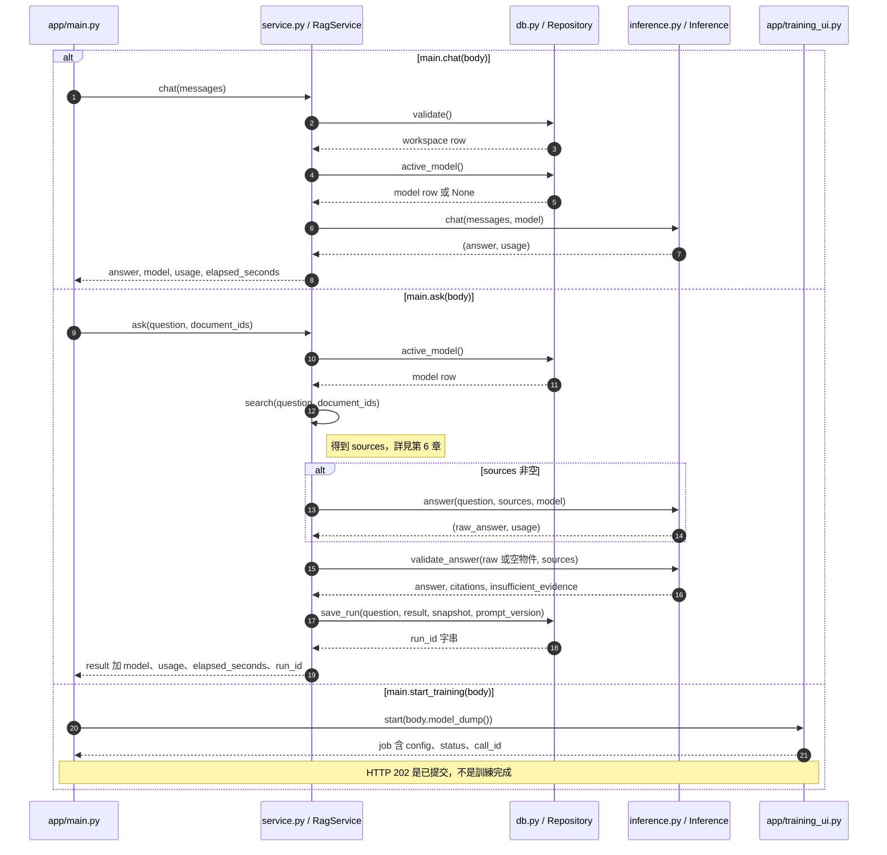
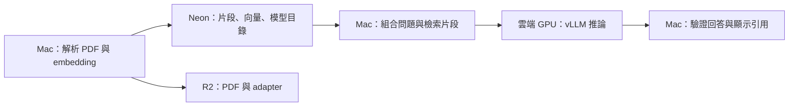

# 第 1 章｜專案全貌：從文件問答到模型微調

所屬部分：第 1 部分「理解模型與專案架構」

本章先建立整個系統的地圖。讀完後，你應能說明一個問題會經過哪些元件、哪些資料送往雲端，以及改善回答時應修改哪個環節。本文以目前程式碼為準；部署實測是既有紀錄，不代表閱讀時服務正在運行。

> 程式碼閱讀方式：本章「專案程式碼」為 2026-10-06 工作區原碼節錄，僅移除共同前置縮排，保留相對縮排與原始換行；片段可能依賴外部變數，不一定可單獨執行。行號以當時原檔為準，程式更新後請由檔案連結與函式名稱核對。

## 本章模組呼叫時序圖：API 如何呼叫服務、推論與訓練模組

每條泳道是實際檔案中的模組／物件；標示「套件」或「服務」的是外部依賴。實線箭頭標出呼叫的函式及輸入，虛線箭頭標出回傳資料或例外；自我箭頭表示同一模組內部操作。欄位清單是回傳結構摘要，不是額外的函式參數。



**呼叫與回傳重點：** 入口是 app/main.py 的三個實際 route 函式。模型不存在會拋出 ValueError；圖中展開的是已選模型的主路徑。下方各章再展開 search、Inference 與訓練任務的內部呼叫。

各函式的實際程式碼與原檔連結見下方小節；圖省略無關的 imports、日誌及部分前置檢查，不代表它們未執行。

## 1.1 專案的三種使用流程：直接聊天、文件問答、LoRA 訓練與比較

直接聊天由 `RagService.chat()` 呼叫生成模型，輸入是對話歷史與 system prompt。它不會自動搜尋已上傳的 PDF，因此「我已上傳報告」不代表聊天模型已讀過報告。這條路徑適合觀察模型原有知識與一般對話能力。

文件問答由 `RagService.ask()` 先檢索片段，再讓模型依片段回答。輸出附來源與頁碼；沒有證據時拒答。LoRA 實驗則包含另一條訓練流程：讀取訓練資料、在 GPU 更新 adapter、儲存產物、載入推論服務，最後比較原模型與 adapter 的回答。三者共用部分模型服務，但資料來源與成功標準不同。

| 流程 | 模型看見什麼 | 主要觀察項目 |
| --- | --- | --- |
| 直接聊天 | 規則與對話歷史 | 既有能力、對話表現 |
| 文件問答 | 規則、問題、檢索原文 | 答案是否有文件支持 |
| LoRA 比較 | 固定實驗題目的輸入 | 訓練前後行為是否改善 |詳細內容

**專案程式碼（節錄）**

檔案：[app/service.py](<../../../app/service.py>)；位置：`RagService.ask`，第 72～78 行。[跳至起始行](<../../../app/service.py#L72>)

<!-- project-code: app/service.py:72-78 -->
```python
sources = self.search(question, document_ids)
usage = {}
if sources:
    raw, usage = self.inference.answer(question, sources, model)
    result = validate_answer(raw, sources)
else:
    result = validate_answer("{}", [])
```

**閱讀重點：** 文件問答先搜尋，再決定生成或拒答；直接聊天不會走這段 search。

**專案程式碼（節錄）**

檔案：[app/lol_lab.py](<../../../app/lol_lab.py>)；位置：`run_case`，第 18～25 行。[跳至起始行](<../../../app/lol_lab.py#L18>)

<!-- project-code: app/lol_lab.py:18-25 -->
```python
model = service.repo.model(model_id)
if not model:
    raise LookupError("模型不存在")
if model["served_name"] not in service.inference.served_models():
    raise ValueError("模型已登錄但推論端點尚未載入；請先部署 adapter")
start = time.monotonic()
answer, usage = service.inference.chat(case["messages"][1:], model,
    system_prompt=case["messages"][0]["content"])
```

**閱讀重點：** A／B 使用指定 model_id 找到模型，再送入同一題 messages。

**專案程式碼（節錄）**

檔案：[app/service.py](<../../../app/service.py>)；位置：`RagService.chat`，第 85～94 行。[跳至起始行](<../../../app/service.py#L85>)

<!-- project-code: app/service.py:85-94 -->
```python
def chat(self, messages):
    started = time.monotonic()
    self.repo.validate()
    model = self.repo.active_model()
    if not model:
        raise ValueError("尚未選擇可用的生成模型")
    answer, usage = self.inference.chat(messages, model)
    return {"answer": answer, "model": {key: model[key] for key in
            ("id", "base_model", "base_revision", "served_name")},
            "usage": usage, "elapsed_seconds": round(time.monotonic() - started, 3)}
```

**閱讀重點：** 直接聊天取得當前模型後就呼叫 inference.chat，沒有 PDF 檢索或引用驗證。

## 1.2 LLM、embedding 模型、向量資料庫各自負責什麼

生成式 LLM 在本專案是 Qwen3-8B，負責根據輸入產生文字；它不負責永久保存你上傳的 PDF。Embedding 模型把文字轉成數值向量，讓程式能比較問題與片段的相似程度；目前預設使用 BGE-M3。

向量資料庫保存向量及原文片段，執行相似度查詢。它找出的是候選證據，不會自己寫答案。這三者的串接可表示為：`問題 → embedding → 資料庫找原文 → LLM 讀原文回答`。不能把向量直接當成可供人閱讀的答案，也不能假設高相似度代表內容一定支持問題中的每個條件。

**專案程式碼（節錄）**

檔案：[app/service.py](<../../../app/service.py>)；位置：`RagService.search`，第 33～41 行。[跳至起始行](<../../../app/service.py#L33>)

<!-- project-code: app/service.py:33-41 -->
```python
def search(self, question, document_ids=None):
    self.repo.validate()
    vector = self.embedder.encode([question], query=True)[0]
    rows = self.repo.search(vector, self.settings.retrieval_k, document_ids)
    return [{"source_id": f"S{i + 1}", "chunk_id": str(row["id"]),
             "document_id": str(row["document_id"]), "filename": row["filename"],
             "page": row["page_number"], "text": row["content"],
             "similarity": row["similarity"]}
            for i, row in enumerate(rows) if row["similarity"] >= self.settings.min_similarity]
```

**閱讀重點：** 問題先轉向量，repo 查原文，再包成 sources；此處尚未生成答案。

## 1.3 本機 Mac、雲端 GPU、Neon、R2 的分工

Mac 執行 FastAPI、PDF 解析、embedding 與 API 呼叫。雲端 GPU 載入大型生成模型，另由獨立訓練工作執行 LoRA。Neon 是 PostgreSQL 資料庫，保存文件資訊、片段、向量、模型登錄與問答紀錄。R2 是物件儲存，保存 PDF 原檔與 adapter 檔案；Modal Volume 則保存模型快取及訓練產物。



本機處理不等於資料全程留在本機：原檔會上傳 R2，片段送往 Neon，問答時被選中的原文與問題會送往生成服務。兩台電腦可連同一個 workspace，但必須使用一致的 embedding 設定與儲存位置。

**專案程式碼（節錄）**

檔案：[app/service.py](<../../../app/service.py>)；位置：`RagService.ingest`，第 23～30 行。[跳至起始行](<../../../app/service.py#L23>)

<!-- project-code: app/service.py:23-30 -->
```python
chunks, pages, warnings = parse_pdf(data, self.settings)
vectors = self.embedder.encode([chunk["text"] for chunk in chunks])
key = f"workspaces/{self.settings.workspace_id}/documents/{digest}.pdf"
self.store.put(key, data, "application/pdf")
document = {"id": str(uuid4()), "sha256": digest,
    "filename": PurePosixPath(filename.replace("\\", "/")).name[:240] or "document.pdf",
    "object_key": key, "page_count": pages, "warnings": warnings}
saved = self.repo.save_document(document, chunks, vectors)
```

**閱讀重點：** embedder 在應用端處理文字，store 保存原檔，repo 保存文件與向量。

## 1.4 完整追蹤一份 PDF 如何變成可引用的回答

假設上傳一份「設備維護手冊.pdf」，第三頁寫著「濾網每 30 天清潔一次」。建檔時，程式計算檔案 SHA-256、抽取各頁文字、切成片段、產生向量，並保存片段的 PDF 頁序。R2 保留原檔，Neon 保留可搜尋的資料。

使用者問「濾網多久清潔一次？」時，程式把問題編碼，查詢相似片段，保留達門檻者，並給它們 `S1` 等臨時來源 ID。LLM 收到問題與原文，可能產生 `{"answer":"每 30 天清潔一次。","source_ids":["S1"],"insufficient_evidence":false}`。驗證器確認 ID 確實存在後，再顯示檔名、第三頁與原文。

這個例子是教學用的假設文件。實際系統只檢查引用結構與 ID，尚不會自動證明「30 天」確實由引用支持；這仍需要品質評估。錯誤答案也可能帶著合法來源。

**專案程式碼（節錄）**

檔案：[app/service.py](<../../../app/service.py>)；位置：`RagService.ask`，第 72～83 行。[跳至起始行](<../../../app/service.py#L72>)

<!-- project-code: app/service.py:72-83 -->
```python
sources = self.search(question, document_ids)
usage = {}
if sources:
    raw, usage = self.inference.answer(question, sources, model)
    result = validate_answer(raw, sources)
else:
    result = validate_answer("{}", [])
result.update({"model": snapshot, "usage": usage,
               "elapsed_seconds": round(time.monotonic() - started, 3),
               "prompt_version": PROMPT_VERSION})
result["run_id"] = self.repo.save_run(question, result, snapshot, PROMPT_VERSION)
return result
```

**閱讀重點：** 沿 sources、raw、result、run_id 追蹤證據、模型輸出、驗證與保存。

## 1.5 分辨 Prompt Engineering、RAG、SFT 與 LoRA 的用途，以及哪些方法會修改模型權重

Prompt Engineering 調整當次輸入，例如指定繁體中文、JSON 格式或證據不足時拒答。RAG 在當次輸入加入外部檢索資料。兩者都不需要改變模型權重；上傳 PDF 走的是建檔流程，並不是模型訓練。

SFT（監督式微調）是用示範回答定義學習目標；LoRA 是限制可更新參數的做法。因此「SFT＋LoRA」可以同時成立：以問答範例訓練，但只更新低秩 adapter。全參數 SFT 則會更新更廣泛的模型參數。本專案實作的是前者。

| 方法 | 改變的東西 | 本專案例子 |
| --- | --- | --- |
| Prompt | 輸入規則 | 只能依據 sources 回答 |
| RAG | 當次提供的證據 | PDF 片段檢索 |
| SFT＋LoRA | Adapter 權重 | 英雄聯盟版本問答訓練 |

資料常更新且要求來源時，可先採 RAG；要穩定改變回答格式或特定任務行為時，才進一步評估微調。LoRA 也可能記住新事實，但不保證可靠記憶，更不提供自動引用。

**專案程式碼（節錄）**

檔案：[training/lora.py](<../../../training/lora.py>)；位置：`train`，第 114～120 行。[跳至起始行](<../../../training/lora.py#L114>)

<!-- project-code: training/lora.py:114-120 -->
```python
model = get_peft_model(model, LoraConfig(r=config.rank, lora_alpha=config.alpha,
    lora_dropout=0.05, target_modules=["q_proj", "k_proj", "v_proj", "o_proj", "gate_proj", "up_proj", "down_proj"],
    bias="none", task_type="CAUSAL_LM", base_model_name_or_path=config.model, revision=config.revision))
trainable = sum(p.numel() for p in model.parameters() if p.requires_grad)
total = sum(p.numel() for p in model.parameters())
if not trainable or any(p.requires_grad and "lora_" not in name for name, p in model.named_parameters()):
    raise RuntimeError("Unexpected trainable base parameters")
```

**閱讀重點：** get_peft_model 加入 adapter，而 requires_grad 檢查限制可更新的權重。

## 實作練習與判讀

先閱讀 `app/service.py` 的 `ingest()`、`ask()`、`chat()`，為三個函式各畫一條輸入與輸出流程。標出會呼叫 embedding、R2、Neon 與 vLLM 的位置。

自我檢查：如果第三頁未被檢索到，應先檢查解析與檢索；如果第三頁已送進模型但答案仍錯，才檢查 prompt 與生成。如果聊天回答沒有引用，不能直接判斷 RAG 壞了，因為聊天走的是另一條路徑。

## 程式碼與延伸閱讀

- [服務流程](../../../app/service.py)
- [推論與回答驗證](../../../app/inference.py)
- [訓練流程](../../../training/lora.py)
- [專案操作說明](../../getting-started.md)

[返回教材目錄](../README.md)
