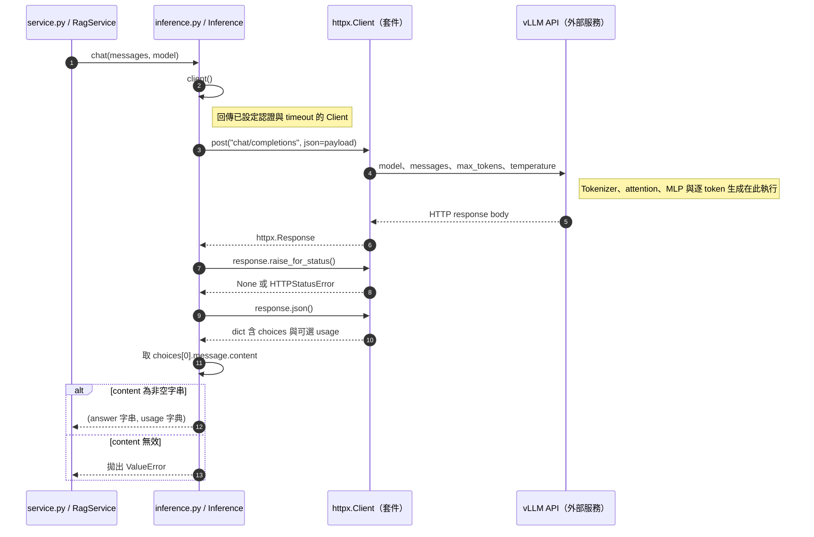

# 第 2 章｜LLM 基礎：模型如何產生回答

所屬部分：第 1 部分「理解模型與專案架構」

本章建立讀懂推論與訓練設定所需的基本概念。公式用來說明資料如何流動，不要求先具備深度學習推導能力。

> 程式碼閱讀方式：本章「專案程式碼」為 2026-10-06 工作區原碼節錄，僅移除共同前置縮排，保留相對縮排與原始換行；片段可能依賴外部變數，不一定可單獨執行。行號以當時原檔為準，程式更新後請由檔案連結與函式名稱核對。

## 本章模組呼叫時序圖：生成模型的實際呼叫邊界

每條泳道是實際檔案中的模組／物件；標示「套件」或「服務」的是外部依賴。實線箭頭標出呼叫的函式及輸入，虛線箭頭標出回傳資料或例外；自我箭頭表示同一模組內部操作。欄位清單是回傳結構摘要，不是額外的函式參數。



**呼叫與回傳重點：** 這張圖只畫專案確實呼叫的接口。專案沒有直接呼叫模型的 attention 或逐 token sampling 函式，因此模型內部以服務邊界註記，不虛構本地函式。

各函式的實際程式碼與原檔連結見下方小節；圖省略無關的 imports、日誌及部分前置檢查，不代表它們未執行。

## 2.1 Token、tokenizer、模型參數與 context window

Token 是 tokenizer 切分文字後的單位，可能是字、詞的一部分、標點或特殊符號。中文一個字不一定恰好是一個 token；同一段文字換 tokenizer 後，長度也可能不同。Tokenizer 將文字轉成整數 ID，模型再把 ID 映射成內部表示。

模型參數是訓練學得的數值，例如線性層權重。Context window 則是單次推論可處理的序列範圍，不是永久記憶。本專案 Modal 推論部署設定最大模型長度 8,128；這是部署限制，不能直接解讀成模型原生能力上限。System prompt、對話、來源片段與生成內容都會占用這個範圍。

**專案程式碼（節錄）**

檔案：[app/embeddings.py](<../../../app/embeddings.py>)；位置：`Embedder.encode`，第 24～26 行。[跳至起始行](<../../../app/embeddings.py#L24>)

<!-- project-code: app/embeddings.py:24-26 -->
```python
for text in texts:
    if len(self._model.tokenizer.encode(prompt + text)) > spec["max_tokens"]:
        raise ValueError("文字超過 embedding token 限制，請縮短問題／CHUNK_CHARS")
```

**閱讀重點：** 限制以 tokenizer 的 token 數判斷，並非直接用字元數。

## 2.2 自回歸生成與「預測下一個 token」的基本概念

自回歸模型依照前面的 token，預測下一個 token 的機率分布，選出一個後再繼續。例如模型看見「濾網每」，可能為下一個 token「30」給出較高機率，再依新序列預測「天」。整段回答不是一次從資料庫取出的完整字串。

序列機率可寫成 $P(x_1,\ldots,x_T)=\prod_{t=1}^{T}P(x_t\mid x_{<t})$。訓練時讓正確下一個 token 更可能出現；推論時依分布選 token。前面選錯年份後，後續可能仍接出語法流暢的解釋，因此「說得很順」不能當成正確性的證據。

**實作界線：** 下一個 token 的機率與生成迴圈由 Qwen／vLLM 實作，本專案沒有自寫解碼器。可沿 app/inference.py 的 Inference.answer() 追到 API 邊界；不要把 HTTP 請求誤認為模型內部演算法。

## 2.3 Transformer、attention 與 MLP 的必要背景，銜接後續 LoRA

Transformer 的 attention 讓每個位置根據其他可見位置調整表示。在因果語言模型中，生成某位置時不能偷看未來答案。簡化公式是 $\operatorname{Attention}(Q,K,V)=\operatorname{softmax}(QK^T/\sqrt{d_k})V$；Q、K 用來計算關聯權重，V 提供要彙整的內容。

MLP 在每個位置上進行非線性特徵轉換。Attention 與 MLP 配合殘差連接、正規化等元件堆疊成多層模型。此處的 Q、K、V 是模型內部張量，與向量資料庫中保存的文件 embedding 不同。

後續 LoRA 會碰到 `q_proj`、`k_proj`、`v_proj`、`o_proj`，以及 MLP 的 `gate_proj`、`up_proj`、`down_proj`。理解這些是線性投影層，便能理解為什麼可以在其權重上加入低秩更新。

**專案程式碼（節錄）**

檔案：[training/lora.py](<../../../training/lora.py>)；位置：`train`，第 114～116 行。[跳至起始行](<../../../training/lora.py#L114>)

<!-- project-code: training/lora.py:114-116 -->
```python
model = get_peft_model(model, LoraConfig(r=config.rank, lora_alpha=config.alpha,
    lora_dropout=0.05, target_modules=["q_proj", "k_proj", "v_proj", "o_proj", "gate_proj", "up_proj", "down_proj"],
    bias="none", task_type="CAUSAL_LM", base_model_name_or_path=config.model, revision=config.revision))
```

**閱讀重點：** 七種 projection 名稱是專案使用 attention／MLP 的切入點；層的運算本體由模型套件提供。

## 2.4 Qwen3-8B 在本專案中的角色，以及固定模型 revision 的意義

專案用 `Qwen/Qwen3-8B` 生成回答，訓練腳本也以同一模型為基礎。8B 是參數規模的名稱，並不代表記憶體只需 8 GB，也不表示所有問題都能正確回答。

訓練與 Modal 部署固定 revision `b968826d9c46dd6066d109eabc6255188de91218`，避免同一模型名稱在不同時間下載到不同檔案。重現實驗需要模型名稱與 revision 一起記錄；adapter 也必須對應相容的基礎權重。只比對「都是 Qwen3」遠遠不足。

**專案程式碼（節錄）**

檔案：[training/lora.py](<../../../training/lora.py>)；位置：`TrainConfig`，第 12～23 行。[跳至起始行](<../../../training/lora.py#L12>)

<!-- project-code: training/lora.py:12-23 -->
```python
class TrainConfig:
    run_id: str
    model: str = "Qwen/Qwen3-8B"
    revision: str = "b968826d9c46dd6066d109eabc6255188de91218"
    rank: int = 8
    alpha: int = 16
    learning_rate: float = 1e-4
    epochs: float = 1
    max_steps: int = -1
    max_length: int = 1024
    gradient_accumulation: int = 4
    seed: int = 42
```

**閱讀重點：** 模型名稱、revision 與訓練參數一起記錄；8B 不是記憶體容量單位。

## 2.5 幻覺、知識缺口與版本資訊答錯的原因

幻覺是模型輸出缺乏根據或與事實不符的內容。成因可能是模型沒學過資訊、混淆相近版本、問題暗含錯誤前提，或生成過程偏向完成一個看似合理的句子。不能單憑模型自述判定其訓練知識截止時間。

專案既有紀錄中，原模型與訓練後 adapter 都曾答錯同一題英雄推出版本。這能證明該次回答失敗，不能證明所有 LoRA 都無效。診斷時要問：證據是否提供？題目是否明確限定版本？訓練樣本是否足夠？評估是否在相同設定下進行？

**實作界線：** 本節討論模型行為與既有失敗紀錄，沒有一個專案函式能單獨解釋幻覺成因。實際輸出紀錄與評閱比貼上無關模型載入程式更有助於核對。

## 2.6 輸入長度、輸出長度與 GPU 記憶體之間的關係

GPU 記憶體不只裝模型權重。推論還需要 KV cache、暫存張量與框架開銷；訓練還需要梯度、optimizer state 與反向傳播用的 activations。凍結基礎權重能節省其梯度與 optimizer 狀態，但不會讓整個基礎模型消失。

用 80 億參數與每參數 2 bytes 粗估，權重本身約 160 億 bytes，約 14.9 GiB；這只是量級估算，實際參數量、資料型別及執行開銷會不同。輸入更長、輸出更多或同時處理更多請求，都可能提高記憶體需求。遇到 OOM 應分辨發生在載入、前向傳播還是生成過程，而非只看模型名稱。

**專案程式碼（節錄）**

檔案：[deploy/modal_vllm.py](<../../../deploy/modal_vllm.py>)；位置：`serve`，第 54～58 行。[跳至起始行](<../../../deploy/modal_vllm.py#L54>)

<!-- project-code: deploy/modal_vllm.py:54-58 -->
```python
args = ["vllm", "serve", MODEL, "--revision", REVISION,
        "--host", "127.0.0.1", "--port", "8000", "--dtype", "auto",
        "--enforce-eager", "--gpu-memory-utilization", "0.90",
        "--max-model-len", "8128", "--max-num-seqs", "1",
        "--enable-lora", "--max-lora-rank", "64", "--max-cpu-loras", "32"]
```

**閱讀重點：** context、同時序列數與 GPU 記憶體預算分別由不同參數控制。

## 實作練習與判讀

選一段中文與一段英文，在相同 tokenizer 下比較 token 數；此練習需要已快取的 Qwen3 tokenizer，首次取得模型檔案需另外下載。

```python
from transformers import AutoTokenizer

tokenizer = AutoTokenizer.from_pretrained(
    "Qwen/Qwen3-8B",
    revision="b968826d9c46dd6066d109eabc6255188de91218",
    local_files_only=True,
)
for text in ["請問濾網多久清潔一次？", "How often should I clean the filter?"]:
    ids = tokenizer.encode(text, add_special_tokens=False)
    print(len(text), len(ids), tokenizer.convert_ids_to_tokens(ids))
```

不要預設中文一定是某個固定倍率。請用實際輸出解釋「以字元切段後仍需要 token 長度檢查」。

## 程式碼與延伸閱讀

- [模型與訓練設定](../../../training/lora.py)
- [部署 context 設定](../../../deploy/modal_vllm.py)
- [實際訓練與回答紀錄](../../lora-training.md)

[返回教材目錄](../README.md)
