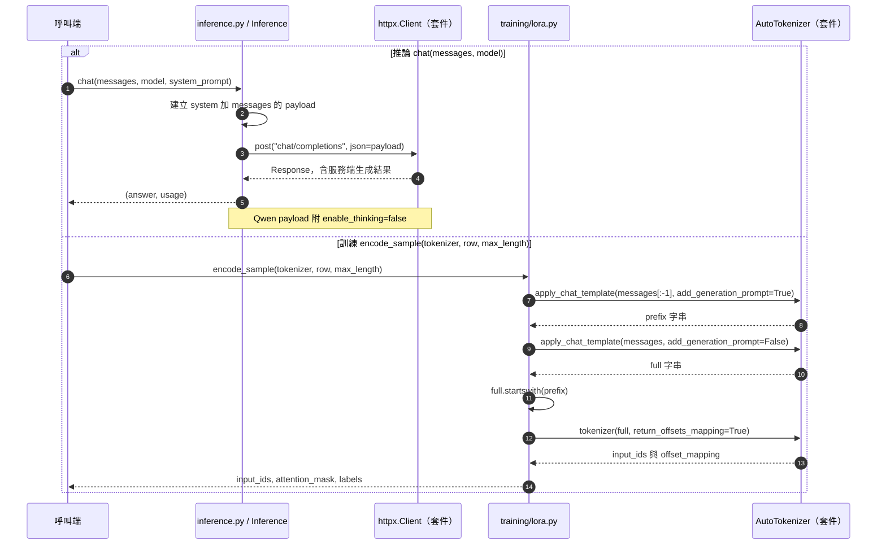

# 第 3 章｜對話格式與生成控制

所屬部分：第 1 部分「理解模型與專案架構」

本章說明 API 中的 messages 如何成為模型真正看見的序列，並把生成參數與專案行為連起來。

> 程式碼閱讀方式：本章「專案程式碼」為 2026-10-06 工作區原碼節錄，僅移除共同前置縮排，保留相對縮排與原始換行；片段可能依賴外部變數，不一定可單獨執行。行號以當時原檔為準，程式更新後請由檔案連結與函式名稱核對。

## 本章模組呼叫時序圖：messages 如何進入推論與訓練 template

每條泳道是實際檔案中的模組／物件；標示「套件」或「服務」的是外部依賴。實線箭頭標出呼叫的函式及輸入，虛線箭頭標出回傳資料或例外；自我箭頭表示同一模組內部操作。欄位清單是回傳結構摘要，不是額外的函式參數。



**呼叫與回傳重點：** 兩次 apply_chat_template 均設定 tokenize=False、enable_thinking=False。為縮短箭頭省略的參數可在第 3.2 節原碼核對；推論端 template 由 vLLM 處理，並非本機呼叫 tokenizer。

各函式的實際程式碼與原檔連結見下方小節；圖省略無關的 imports、日誌及部分前置檢查，不代表它們未執行。

## 3.1 system、user、assistant 訊息的角色

`system` 描述助理的任務與規則；`user` 提供問題；`assistant` 表示模型已產生或訓練資料中的示範回答。角色是對話結構的一部分，不只是把「使用者：」印在文字前面。

在文件問答中，system 指定繁體中文、依證據回答及 JSON 格式，user 內容是包含 question 與 sources 的 JSON。直接聊天則用一般助理規則與歷史 messages。角色分工有助於模型理解任務，但不是不可突破的安全隔離，因此仍需要應用程式驗證。

**專案程式碼（節錄）**

檔案：[app/inference.py](<../../../app/inference.py>)；位置：`Inference.answer`，第 30～41 行。[跳至起始行](<../../../app/inference.py#L30>)

<!-- project-code: app/inference.py:30-41 -->
```python
def answer(self, question, sources, model):
    payload = {
        "model": model["served_name"],
        "messages": [
            {"role": "system", "content": SYSTEM_PROMPT},
            {"role": "user", "content": json.dumps({"question": question, "sources": sources},
                                                     ensure_ascii=False)},
        ],
        "max_tokens": 1200,
        "temperature": 0.2,
        "response_format": {"type": "json_object"},
    }
```

**閱讀重點：** system 放規則，user 放 question 與 sources，兩者不是同一種資料。

## 3.2 Chat template 如何把對話轉換成模型輸入

模型不直接處理 Python 字典清單。Chat template 將 messages 轉成含角色邊界、結束標記及生成起點的文字／token 序列。不同模型可能使用不同特殊 token，不能任意把某一套格式套用到另一個模型。

本專案訓練以 `tokenizer.apply_chat_template()` 產生格式，再檢查 prompt 與完整回答的前綴是否一致。這可避免人工串接格式漏掉特殊符號。若先取得字串再 tokenize，程式使用 `add_special_tokens=False`，避免重複插入已有的特殊 token。Template 的介面背景可參考 [Transformers 官方說明](https://huggingface.co/docs/transformers/chat_templating)。

**專案程式碼（節錄）**

檔案：[training/lora.py](<../../../training/lora.py>)；位置：`encode_sample`，第 53～62 行。[跳至起始行](<../../../training/lora.py#L53>)

<!-- project-code: training/lora.py:53-62 -->
```python
def encode_sample(tokenizer, row, max_length):
    """Assert template prefix alignment; train only completion, including EOS."""
    messages = row["messages"]
    prefix = tokenizer.apply_chat_template(messages[:-1], tokenize=False,
        add_generation_prompt=True, enable_thinking=False)
    full = tokenizer.apply_chat_template(messages, tokenize=False,
        add_generation_prompt=False, enable_thinking=False)
    if not full.startswith(prefix):
        raise ValueError("Chat template prefix mismatch; refusing an incorrect loss mask")
    encoded = tokenizer(full, add_special_tokens=False, return_offsets_mapping=True)
```

**閱讀重點：** 先由原生 template 渲染，再以 add_special_tokens=False 編碼，避免重複特殊標記。

## 3.3 專案為什麼使用原生 Qwen3 template 與 enable_thinking=False

專案在 Qwen 推論請求傳入 `chat_template_kwargs={"enable_thinking": False}`；訓練編碼也指定相同選項。目的在於保持當前實驗的回答格式一致，避免訓練與服務使用不同的 template 分支。

這個參數是模型 template 的選項，不是所有 OpenAI-compatible 服務都理解的通用標準；相容端點仍需實際支援。關閉 thinking 格式也不代表答案一定正確或模型完全不進行內部計算。教學比較應把此設定列入實驗條件。

**專案程式碼（節錄）**

檔案：[app/inference.py](<../../../app/inference.py>)；位置：`Inference.answer`，第 42～48 行。[跳至起始行](<../../../app/inference.py#L42>)

<!-- project-code: app/inference.py:42-48 -->
```python
if "qwen" in model["base_model"].lower():
    payload["chat_template_kwargs"] = {"enable_thinking": False}
with self.client() as client:
    result = client.post("chat/completions", json=payload)
    result.raise_for_status()
    response = result.json()
return response["choices"][0]["message"]["content"], response.get("usage", {})
```

**閱讀重點：** Qwen 請求附帶 enable_thinking=False；訓練編碼也使用相同選項。

## 3.4 temperature、max_tokens 的作用

Temperature 控制 token 分布的尖銳程度，概念上用 `softmax(logits / T)` 計算。較低的正溫度使高分 token 更占優勢，但不會補上缺失的知識。專案聊天與文件問答都設為 0.2；仍不能保證每次輸出逐字相同。

`max_tokens` 是最多生成多少 token 的上限，不是要求模型一定寫滿。文件問答設為 1,200，聊天設為 800。上限太小可能截斷 JSON 或句子；太大則可能增加最壞情況延遲。調整時也要確保 prompt 加上生成預算不超過部署 context 限制。

**專案程式碼（節錄）**

檔案：[app/inference.py](<../../../app/inference.py>)；位置：`Inference.chat`，第 50～57 行。[跳至起始行](<../../../app/inference.py#L50>)

<!-- project-code: app/inference.py:50-57 -->
```python
def chat(self, messages, model, system_prompt="你是友善的助理，請使用繁體中文回答。"):
    payload = {
        "model": model["served_name"],
        "messages": [{"role": "system", "content": system_prompt}, *messages],
        "max_tokens": 800, "temperature": 0.2,
    }
    if "qwen" in model["base_model"].lower():
        payload["chat_template_kwargs"] = {"enable_thinking": False}
```

**閱讀重點：** max_tokens=800 是輸出上限，temperature=0.2 是抽樣設定；文件問答上限另為 1200。

## 3.5 多輪聊天如何帶入歷史訊息，以及歷史內容如何消耗 context

多輪聊天是在下一次請求中再次提交前面的對話。模型服務不會因為曾經收到一次問題，就自動知道瀏覽器所有歷史。`Inference.chat()` 把 system 訊息放在收到的 messages 前面，並將整份清單送往 API。

歷史愈長，輸入 token 愈多。如果先前回答有錯，後續模型也可能沿用它。目前這個函式沒有做 token 級摘要或自動滑動視窗；API 對訊息數或文字長度的限制也不等同於模型 context 預算。未來若加入摘要，需保留使用者限制與重要事實，並評估摘要遺漏造成的影響。

**專案程式碼（節錄）**

檔案：[app/inference.py](<../../../app/inference.py>)；位置：`Inference.chat`，第 50～61 行。[跳至起始行](<../../../app/inference.py#L50>)

<!-- project-code: app/inference.py:50-61 -->
```python
def chat(self, messages, model, system_prompt="你是友善的助理，請使用繁體中文回答。"):
    payload = {
        "model": model["served_name"],
        "messages": [{"role": "system", "content": system_prompt}, *messages],
        "max_tokens": 800, "temperature": 0.2,
    }
    if "qwen" in model["base_model"].lower():
        payload["chat_template_kwargs"] = {"enable_thinking": False}
    with self.client() as client:
        result = client.post("chat/completions", json=payload)
        result.raise_for_status()
        response = result.json()
```

**閱讀重點：** *messages 將傳入歷史加入請求，這裡沒有自動摘要或 token 級裁切。

## 3.6 訓練與推論格式不一致可能造成的問題

假設訓練資料用原生角色標記，但推論改成純文字「Q: ... A: ...」，模型接收到的分布就變了；若訓練 assistant 包含某種格式而推論 template 又改用另一種，可能出現多餘標記、不當續寫或品質下降。

本專案利用同一基礎模型 revision、原生 template 與 thinking 選項降低此差異。不過固定 revision 並未固定所有軟體行為，仍需記錄 Transformers、vLLM 版本與 template 輸出。除錯時先查看實際 messages 與渲染後序列，再調整模型超參數。

**專案程式碼（節錄）**

檔案：[training/lora.py](<../../../training/lora.py>)；位置：`encode_sample`，第 56～65 行。[跳至起始行](<../../../training/lora.py#L56>)

<!-- project-code: training/lora.py:56-65 -->
```python
prefix = tokenizer.apply_chat_template(messages[:-1], tokenize=False,
    add_generation_prompt=True, enable_thinking=False)
full = tokenizer.apply_chat_template(messages, tokenize=False,
    add_generation_prompt=False, enable_thinking=False)
if not full.startswith(prefix):
    raise ValueError("Chat template prefix mismatch; refusing an incorrect loss mask")
encoded = tokenizer(full, add_special_tokens=False, return_offsets_mapping=True)
tokens = encoded["input_ids"]
if len(tokens) > max_length:
    raise ValueError("Sample exceeds max_length; increase it or edit data, do not silently truncate answers")
```

**閱讀重點：** prefix 不一致或長度超限都會中止，避免悄悄更改訓練目標。

## 實作練習與判讀

在第 2 章的 tokenizer 環境中，先觀察字串，不啟動 GPU：

```python
messages = [
    {"role": "system", "content": "請使用繁體中文回答。"},
    {"role": "user", "content": "什麼是向量？"},
]
prompt = tokenizer.apply_chat_template(
    messages, tokenize=False,
    add_generation_prompt=True, enable_thinking=False,
)
print(repr(prompt))
```

找出角色分界與 assistant 起點。再閱讀 `app/inference.py`，列出聊天與文件問答在 system、輸入資料、輸出限制三方面的不同。

## 程式碼與延伸閱讀

- [API payload 與模型判定](../../../app/inference.py)
- [訓練 template 編碼](../../../training/lora.py)

[返回教材目錄](../README.md)
